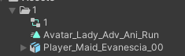
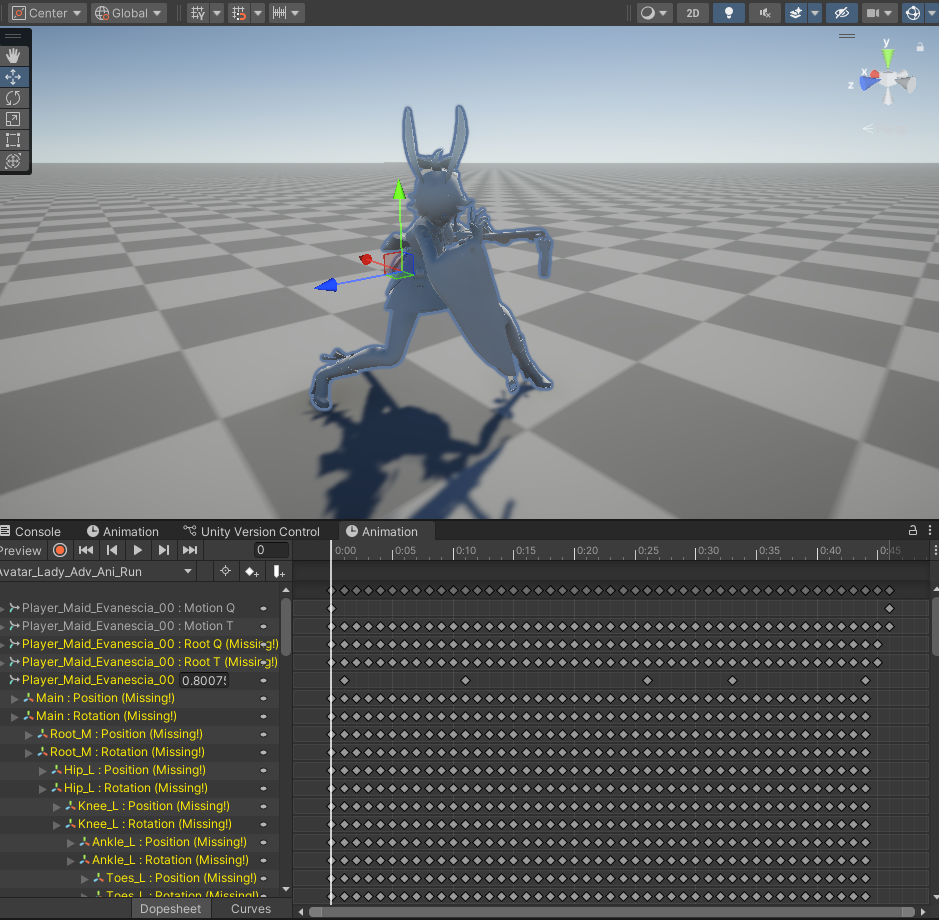
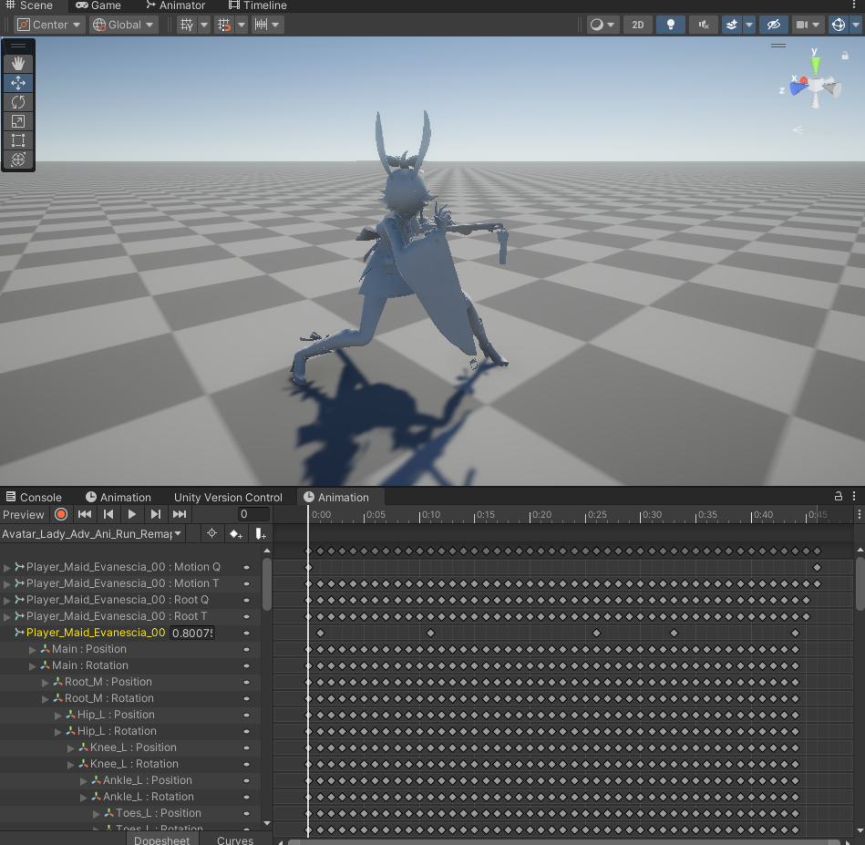
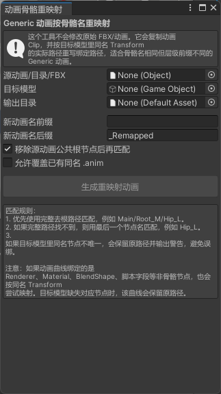
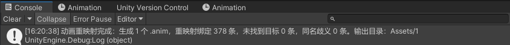

### 项目地址

::github{repo="StellaAstra/UnityTools"}
### 1. 插件用途

`GenericAnimationBoneRemapperWindow` 是一个 Unity 编辑器插件，用于把已有 Generic 动画复制成新的 `.anim` 文件，并根据目标模型中的同名 `Transform` 重写动画曲线绑定路径。

它适合解决以下问题：

- 源动画和目标模型的骨骼名称基本一致，但层级前缀或根节点名称不同。
- 动画来自 FBX、单个 `.anim` 或动画目录，需要批量生成可直接挂到目标模型上的新动画。
- 不希望修改原始 FBX 或原始动画资源，只希望生成一份安全的重映射副本。

插件入口位于 Unity 菜单：`Tools/SRTEST/Generic动画按骨骼名重映射`。

### 2. 文件位置与核心类

插件脚本位于 `Assets/Editor/GenericAnimationBoneRemapperWindow.cs`，继承自 Unity 的 `EditorWindow`，只在编辑器环境下运行。

核心结构如下：

- `GenericAnimationBoneRemapperWindow`：编辑器窗口主体，负责绘制界面、读取用户配置、触发动画生成流程。
- `PathMap`：目标模型骨骼路径映射表，负责根据完整路径或末端骨骼名解析目标路径。
- `RemapResult`：单个动画重映射结果统计，记录成功、未解析、歧义绑定数量。
- `PathResolveStatus`：路径解析状态，包含 `Resolved`、`Unresolved`、`Ambiguous`。

### 3. 实现流程

插件的主流程由 `RemapSelectedAnimations()` 驱动：

1. 读取输出目录：
   - 如果用户没有指定输出目录，默认使用 `Assets/SRTEST/Animation/Remapped`。
   - 如果指定目录不在 `Assets` 下，会中断并输出错误。
2. 自动创建输出目录：
   - `EnsureFolderExists()` 会逐级创建缺失的 Unity 资源目录。
3. 收集源动画：
   - `CollectClips()` 支持三类输入：单个 `AnimationClip`、包含 `.anim` 的文件夹、包含动画片段的 FBX。
   - 会过滤掉预览动画和不可复制的隐藏资源。
4. 扫描目标模型骨骼：
   - `BuildTargetPathMap()` 会遍历目标模型根节点下所有子 `Transform`。
   - 同时建立完整路径映射和末端节点名映射。
5. 复制并重写动画：
   - `CreateRemappedClip()` 先复制源动画序列化数据，再清空原曲线。
   - 遍历普通曲线和对象引用曲线，逐条调用 `RemapBinding()` 重写绑定路径。
6. 保存新动画资源：
   - 根据前缀、源动画名、后缀生成新文件名。
   - 默认自动生成唯一资源路径；如果开启覆盖，则会删除同名旧资源后重新创建。
7. 输出统计日志：
   - 完成后在 Console 中输出生成数量、成功重映射数量、未找到目标数量、同名歧义数量和输出目录。

### 4. 路径匹配规则

插件会按以下优先级重映射动画绑定路径：

1. **完整去根路径匹配**  
   如果启用“移除源动画公共根节点后再匹配”，插件会先去掉源动画绑定路径中的公共根节点，再用剩余路径匹配目标模型。

   例如源动画路径为 `Armature/Hips/Spine`，公共根节点为 `Armature`，则实际用于匹配的路径为 `Hips/Spine`。

2. **目标模型完整路径匹配**  
   如果目标模型中存在相同相对路径，则直接绑定到目标路径。

3. **末端节点名匹配**  
   如果完整路径找不到，则使用最后一个节点名匹配。

   例如 `OldRoot/Bone/Hip_L` 可以尝试匹配目标模型中唯一名为 `Hip_L` 的节点。

4. **同名歧义保护**  
   如果目标模型中存在多个同名节点，插件不会随机绑定，而是保留原路径并输出警告，避免误绑到错误骨骼。

5. **未找到节点保护**  
   如果目标模型中找不到对应节点，插件会保留原绑定路径并输出警告。

### 5. 使用步骤

1. 将脚本放在 `Assets/Editor` 目录下，确保 Unity 能以编辑器脚本方式编译。
2. 在 Unity 顶部菜单打开 `Tools/SRTEST/Generic动画按骨骼名重映射`。
3. 在窗口中配置参数：
   - `源动画/目录/FBX`：选择单个动画、动画目录或包含动画片段的 FBX。
   - `目标模型`：选择目标角色的 Prefab 或 FBX 根对象。
   - `输出目录`：选择新动画保存目录；不填则使用默认目录。
   - `新动画名前缀`：可选，用于给生成动画统一添加前缀。
   - `新动画名后缀`：默认 `_Remapped`，用于区分原动画和生成动画。
   - `移除源动画公共根节点后再匹配`：建议保持开启，适合源动画带统一根节点前缀的情况。
   - `允许覆盖已有同名 .anim`：开启后会删除输出目录下同名动画并重新生成。
4. 点击 `生成重映射动画`。
5. 在 Console 查看生成结果和警告信息。
6. 将生成的 `.anim` 文件放入目标角色 Animator Controller 中测试播放效果。
#### Example：
示例目录

重映射前因为层级不同导致Anim无法识别匹配Rig

重映射后Anim能够识别并匹配Rig

### 6. 参数说明

#### 参数面板


| 参数 | 说明 | 建议 |
| --- | --- | --- |
| `源动画/目录/FBX` | 动画来源，可以是单个 `AnimationClip`、目录或 FBX | 批量处理时选择目录或 FBX |
| `目标模型` | 用来提供骨骼路径的目标模型根对象 | 选择最终要播放动画的角色 Prefab/FBX |
| `输出目录` | 新 `.anim` 文件保存位置 | 建议单独建目录管理生成动画 |
| `新动画名前缀` | 生成动画名前缀 | 可按角色名或来源区分 |
| `新动画名后缀` | 生成动画名后缀 | 默认 `_Remapped` 即可 |
| `移除源动画公共根节点后再匹配` | 去掉源动画所有绑定共有的第一层根节点 | 大多数跨模型动画迁移场景建议开启 |
| `允许覆盖已有同名 .anim` | 是否覆盖输出目录中已有同名文件 | 确认需要重新生成时再开启 |

### 7. 输出与日志

生成完成后，Console 会输出类似信息：

```text
动画重映射完成：生成 3 个 .anim，重映射绑定 120 条，未找到目标 2 条，同名歧义 1 条。输出目录：Assets/SRTEST/Animation/Remapped
```


日志含义：

- `生成`：成功创建的新动画数量。
- `重映射绑定`：成功改写到目标模型路径的曲线绑定数量。
- `未找到目标`：目标模型中没有匹配节点，已保留源路径的绑定数量。
- `同名歧义`：目标模型中存在多个同名节点，插件为避免误绑而保留源路径的绑定数量。

### 8. 注意事项

- 插件主要面向 **Generic 动画**，不负责 Humanoid Avatar 的肌肉映射或 Avatar Retarget 设置。
- 它不会修改源 FBX、源 `.anim` 或目标模型，只会生成新的动画资源。
- 如果目标模型骨骼存在大量重名节点，建议先规范骨骼命名，否则插件会保留原路径并输出歧义警告。
- 如果动画曲线绑定的是 Renderer、Material、BlendShape 或脚本字段等非骨骼路径，插件也会按同名 `Transform` 尝试映射；目标缺失时会保留原路径。
- 如果生成动画播放后部分骨骼不动，应优先检查 Console 中的 `未找到目标` 和 `同名歧义` 警告。
- 如果希望重新生成同名动画，可以开启 `允许覆盖已有同名 .anim`，或者手动删除旧动画后再生成。

### 9. 常见问题

**生成按钮不可点击怎么办？**  
需要同时指定 `源动画/目录/FBX` 和 `目标模型`，否则按钮会被禁用。

**为什么生成的动画仍然有部分曲线没有生效？**  
通常是目标模型缺少对应节点，或目标模型中存在多个同名节点导致插件保留了原路径。可以根据 Console 警告逐个检查。

**为什么没有覆盖旧动画，而是生成了带编号的新文件？**  
默认使用 `AssetDatabase.GenerateUniqueAssetPath()` 防止误覆盖。若要覆盖旧资源，需要开启 `允许覆盖已有同名 .anim`。

**源动画是 FBX 内嵌动画时可以处理吗？**  
可以。选择 FBX 资源后，插件会读取其中可复制的 `AnimationClip` 子资源，并为每个片段生成独立 `.anim`。

**这个插件能把 Humanoid 动画转成 Generic 动画吗？**  
不能。它只处理动画曲线绑定路径，不处理 Rig 类型转换、Avatar 配置或 Humanoid 肌肉曲线重定向。
