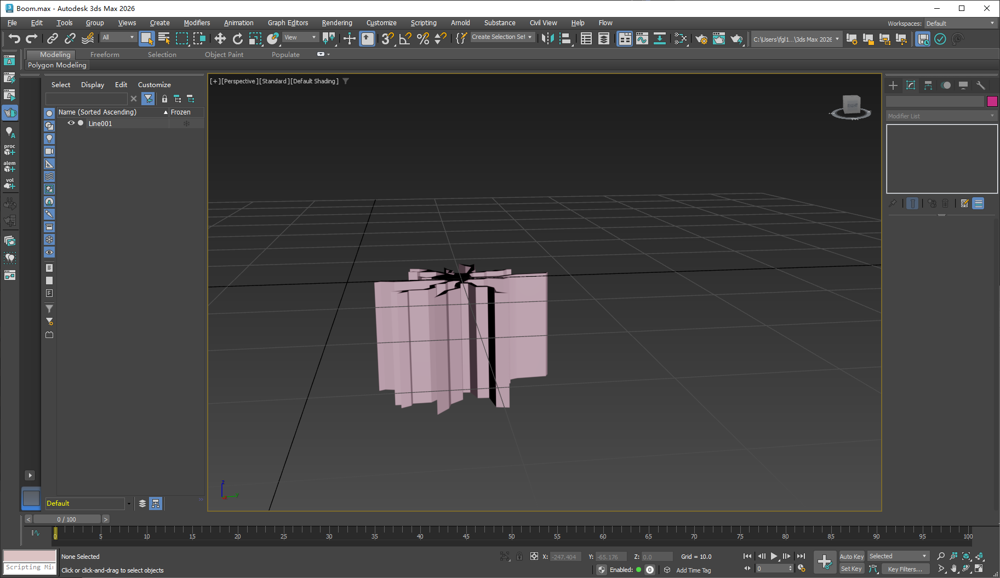
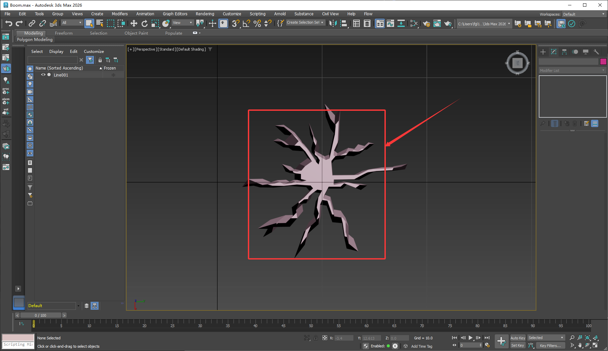
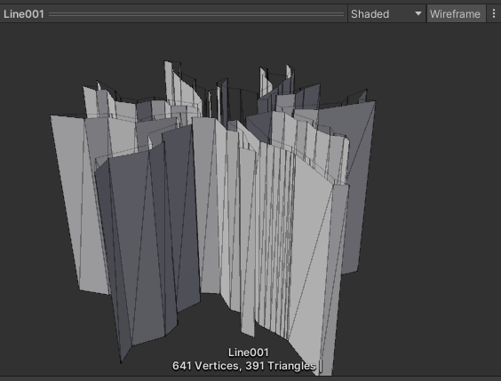
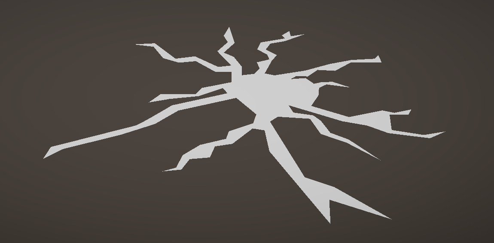
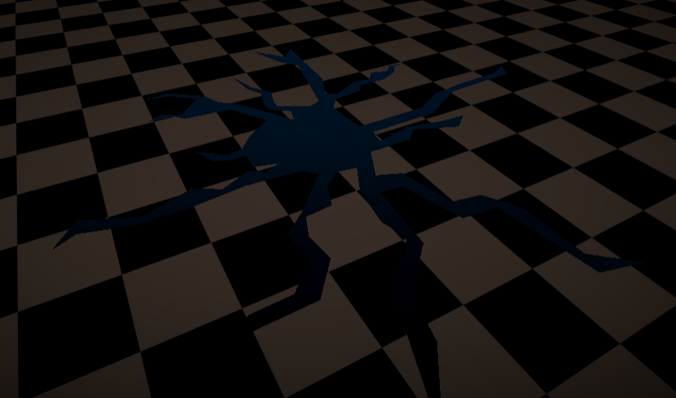
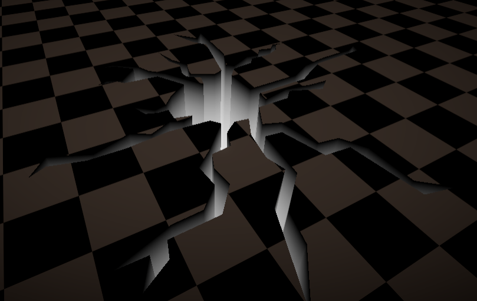

:::tip
主要原理就是使用蒙版测试(Stencil Test)来实现

:::

# 一.准备阶段

使用3dsmax制作需要的模型，通过通过shapes中的line来拉一个线框让后通过Extrude来挤压-10单位，然后删除顶面导出到Unity中，因为用不到uv所以不用管直接导出即可。模型如下：





:::color4
注意：要保证模型底面从上往下看是不被剔除的，同时注意因为3dsmax是右手坐标系而我们的Unity引擎是左手坐标系所以我们在3dsmax中将模型的local坐标系的y轴旋转到向上当然这也可以在后面shader编写中进行处理。

:::

接下来我们将处理好的模型导入到Unity中如下图所示：



# 二.Shader编写

主要的核心思路就是制作一个mask遮罩。我使用了两个pass，第一个pass主要是将模型的y轴变为0让其变成一个面片，然后让其作为遮罩使用，如下图所示



这个面片的作用就是用来做遮罩的，这时候我们设置Stencil方式，如下代码所示

```plain
Stencil
{
  Ref 1
  Comp Never
  Fail Replace
}
```

设置参考值为1，比较方式设置为永远不通过，不通过就会将原来的的屏幕蒙版值0替换成参考值1，如下图所示：

:::color4
注意：在进入pass之前我们先要设置其渲染顺序，这里我将其设置成立"Geomertry-2"

:::



代码如下：

```plain
v.posOS.y = 0;
```

接下来我们来看第二个pass，由于之前我们在max中将模型的上面的面片删除，因此我们能够从模型上面往下看到下面，所以我们通过模型的y值来表示其深度，因为当时在max中我将模型向下挤压了-10个单位所以我的y全为负值，所以看上去是黑色的，接下来我们对其y值取绝对值并且通过定义一个变量来控制其深浅位置，如下图所示：



代码如下：

```plain
 float mask = abs(i.posOS.y) / _Depth;
```

:::color4
注意：上面的效果是我们设置了Stencil Test的结果

:::

接下来我们来看Stencil设置，代码如下：

```plain
Stencil
{
  Ref 1
  Comp Equal
}
```

设置参考值为1，比较方式设置为等于，不通过的地方将会被剔除，这就是为什么我们不能看到模型的侧面。这样我们的主要效果就完成了。

# 三、呼吸效果

我们通过时间参数来实现动态呼吸效果，直接上代码！

```plain
float t = sin(_Time.y) * 0.3 + 0.7;
```

最后我们给地裂加上一个可变的颜色，通过lerp函数进行操作，代码如下：

```plain
float4 color = lerp(0, _Color * t, mask);
```

这样我们的最终效果就完成了！！

效果图：


# 四、完整代码

下面话不多说直接上完整代码！

```plain
Shader "VFX/dilie"
{
    Properties
    {
        [HDR]_Color("Color", Color) = (1,1,1,1)
        _Depth ("Depth", Range(0.1,10)) = 5
    }
    SubShader
    {
        Tags
        {
            "RenderPipeline"="UniversalPipeline"
            "RenderType"="Opaque" 
            "Queue"="Geometry-2"
        }

        Pass
        {
            Tags {"LightMode" = "SRPDefaultUnlit"}
            
            Stencil
            {
                Ref 1
                Comp Never
                Fail Replace
            }
            
            HLSLPROGRAM
            #pragma vertex vert
            #pragma fragment frag
            
            #include "Packages/com.unity.render-pipelines.universal/ShaderLibrary/Core.hlsl"
            #include "Packages/com.unity.render-pipelines.universal/ShaderLibrary/Lighting.hlsl"

            struct Attributes
            {
                float4 posOS        : POSITION;
                float2 texcoord     : TEXCOORD0;
            };

            struct Varyings
            {
                float4 posCS        : SV_POSITION;
                float2 uv           : TEXCOORD0;
                float3 posWS        : TEXCOORD1;
                float3 posVS        : TEXCOORD2;
            };

            Varyings vert(Attributes v)
            {
                Varyings o = (Varyings)0;
                v.posOS.y = 0;

                o.posWS = TransformObjectToWorld(v.posOS.xyz);
                o.posVS = TransformWorldToView(o.posWS);
                o.posCS = TransformWViewToHClip(o.posVS);

                o.uv = v.texcoord;
                return o;
            }

            half4 frag(Varyings i) : SV_Target
            {
                return 1;
            }
            ENDHLSL
        }

        Pass
        {
           Tags {"LightMode" = "UniversalForward"}
           Stencil
           {
               Ref 1
               Comp Equal
           }
            
           Cull Off
           HLSLPROGRAM
           #pragma vertex vert
           #pragma fragment frag
           
           #include "Packages/com.unity.render-pipelines.core/ShaderLibrary/Color.hlsl"
           #include "Packages/com.unity.render-pipelines.universal/ShaderLibrary/Core.hlsl"
           #include "Packages/com.unity.render-pipelines.universal/ShaderLibrary/Lighting.hlsl"
           #include "Packages/com.unity.render-pipelines.universal/ShaderLibrary/ShaderGraphFunctions.hlsl"

           CBUFFER_START(UnityPerMaterial)
                float4 _Color;
                float _Depth;
           CBUFFER_END

           struct Attributes
           {
               float4 posOS        : POSITION;
               float2 texcoord     : TEXCOORD0;
           };

           struct Varyings
           {
               float4 posCS        : SV_POSITION;
               float2 uv           : TEXCOORD0;
               float4 posOS        : TEXCOORD1;
               float3 posWS        : TEXCOORD2;
               float3 posVS        : TEXCOORD3;
                
           };
            
           Varyings vert(Attributes v)
           {
               Varyings o = (Varyings)0;
               o.posOS = v.posOS;

               o.posWS = TransformObjectToWorld(o.posOS.xyz);
               o.posVS = TransformWorldToView(o.posWS);
               o.posCS = TransformWViewToHClip(o.posVS);

               o.uv = v.texcoord;
               return o;
                
           }

           half4 frag(Varyings i) : SV_Target
           {
               float mask = abs(i.posOS.y) / _Depth;
               float t = sin(_Time.y) * 0.3 + 0.7;
               float4 color = lerp(0, _Color * t, mask);
               return color;
           }
           ENDHLSL
        }
    }
}
```
