## 一.核心原理讲解

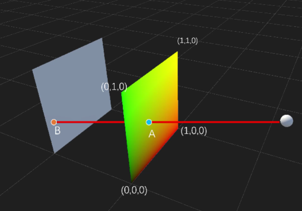

我们要做的就是求出B点位置坐标，然后用B的坐标去采样一张贴图，那么当我们相机转动视角的时候就会实现一个视差一样的效果，就相当于在A的平面计算一个假的平面，他们之间存在一定的深度关系，这样我们就能实现光追视差效果。不明白的话我们简化一下上面的图，请看下面这张。

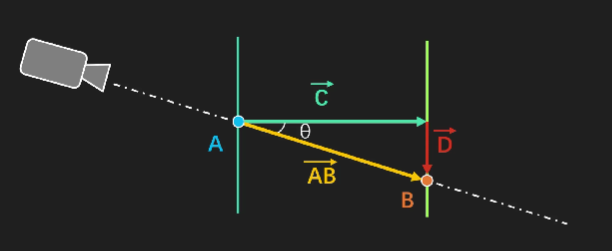

我们要求出B点的坐标，通过**射线与平面相交**

$B = A +\vec{C} + \vec{D}$

我们将$\vec{C} + \vec{D}$合并得到

$B = A + \vec{AB}$

我们现在只要求出$ \vec{AB} $就能求到B的位置坐标

```plain
float costheta = dot(viewTS, float3(0,0,1));
float ABLenght = depth / costheta;
float3 A = float3(uv,0);
float3 B = A + ABLenght*viewTS;        //到这边我们就已经计算出B的坐标了注意viewTS要进行归一化处理
//接下来我们用B点的xy来采样贴图就能得到我们正确的视差贴图效果
float4 p = tex2D(Map, saturate(B.xy));
```

## 二.实现过程讲解

### 1.素材准备

5张贴图就可以了，一张相框，一张角色，一张背景，一张卡背，还有一张noise噪波

### 2.视差效果核心代码

#### 2.1深度坐标计算

```plain
//对标上面的核心原理讲解思路一样这边在开头对uv进行缩放平移，参数暴露在材质面板上
uv = uv*ParallaxMap_ST.xy + ParallaxMap_ST.zw;
float cosTheta = dot(viewTS,float3(0,0,1));
float viewTSLength = depth / cosTheta;
float3 startPoint = float3(uv,0);
float3 endPoint = startPoint + viewTS*viewTSLength;
float4 parallax = tex2D(ParallaxMap,saturate( endPoint.xy));
return parallax;
```

上面就是计算角色层的深度坐标，这里我们把它叫做p1，让我们来看一下效果

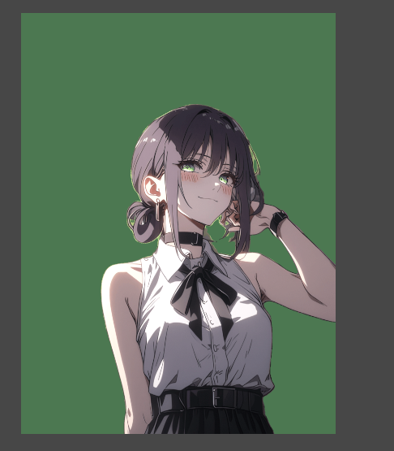

没有问题，接下来背景层同理，我们来看一下效果

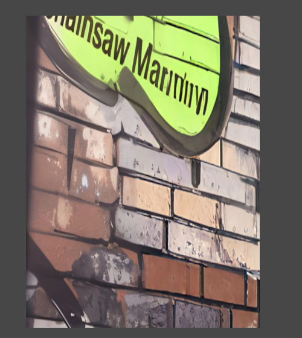

很好也没问题，这里我们将背景层叫做p2

**敲黑板！！！注意**

我们在计算p2层的时候要将他的uv单独计算出来这会在后面实现背景流光效果中用到

#### 2.2 背景层流动效果实现

下面我们来时实现背景层的流光效果，这时候就要使用我们的noise贴图了

我们分别采样两次noise贴图并且加上Time来实现流动效果，注意我们使用的是p2的uv

代码如下

```plain
float noise = tex2D(_P2NoiseMap,parallaxUVP2 + float2(0,_Time.x*0.8) );
float noise2 = tex2D(_P2NoiseMap,parallaxUVP2.yx - float2(_Time.x,_Time.x*0.9) );   
noise = pow(noise*noise2,_P2NoiseMapVec.x) * _P2NoiseMapVec.y;
```

让我们来看一效果

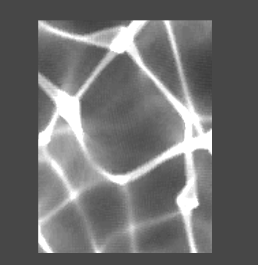

很好这样的波动流光效果有了

接下来我们将p2与流光效果进行叠加使用Luminace函数来进行条件判断

<font style="color:rgba(0, 0, 0, 0.85);">如果 Luminance(p2) 大于 2.0 / 256.0，则 p2 会被乘以 (1 + noise)，这会使 p2 的亮度增加，具体增加的量取决于 noise 的值。</font>

<font style="color:rgba(0, 0, 0, 0.85);">代码如下:</font>

```plain
p2 = p2 *(1+ noise * ( Luminance(p2) > (2.0 / 256.0) ) ) * _ParallaxMap2Tint;
```

我们再来看一下效果

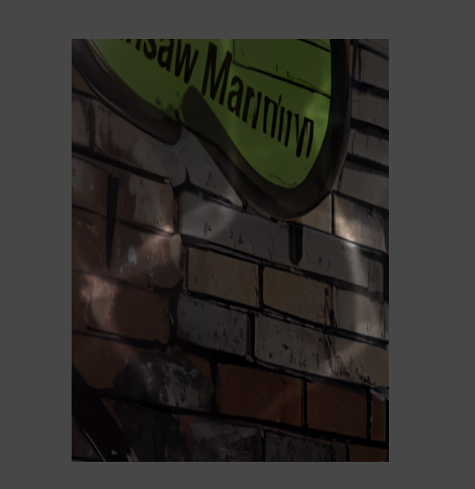

这个可能不是很好我们看另一个

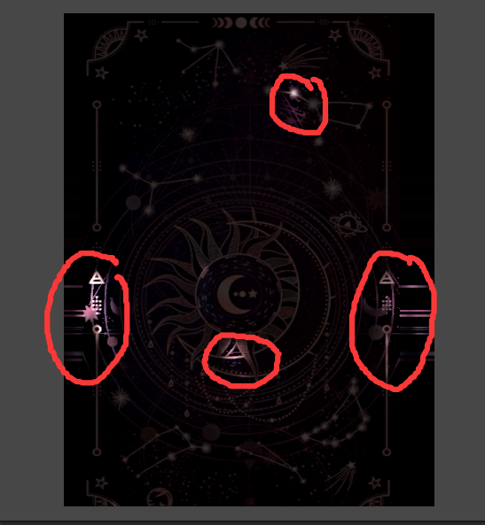

非常完美

#### 2.3画框流光效果

同样采样画框贴图让后将贴图<font style="color:rgba(0, 0, 0, 0.85);"> frame 与 frame 乘以正弦函数平方后的结果再乘以0.5相加。这会根据正弦函数的值来调整每个像素的亮度，从而产生一种随时间变化的动态效果。</font>

<font style="color:rgba(0, 0, 0, 0.85);">上代码：</font>

```plain
frame = frame + ( frame)* pow(sin( uv.y + _Time.y*0.5),2) *0.5;
```

然后我们开始进行融合

#### 2.4 图层融合

通过Alpah蒙版进行融合,p1 在 p2的上面

```plain
float4 color = lerp(p2,p1,p1.a);
```

请看p1的alpha通道

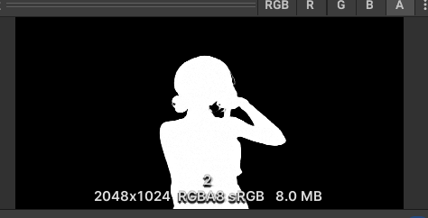

通过p1的alpha通道来lerp可以保证p1层在p2层上面，我们来看效果

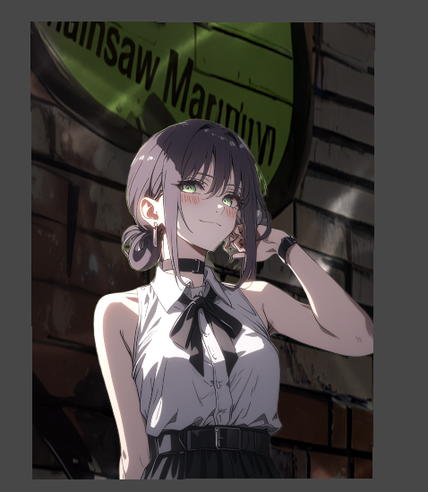

当当混合完成接下来我们将画框层也通过Alpah蒙版进行融合，使相框在最外层看效果

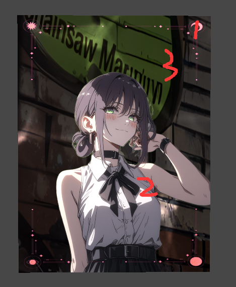

很好到这边我们正面效果就已经完成了！！！鼓掌，接下来我们来实现背面的彩色效果

### 3. 背面效果

#### 3.1判断是否是背面和进行uv翻转

首先我们要把<font style="color:rgba(0, 0, 0, 0.85);">多边形剔除禁用这样我们就有背面了</font>

<font style="color:rgba(0, 0, 0, 0.85);">我们申明一个变量</font><font style="color:rgb(56, 58, 66);background-color:rgb(250, 250, 250);">backFace</font><font style="color:rgba(0, 0, 0, 0.85);">并使用 VFace 语义来获取当前面的信息，我们知道VFace = 1表示当前渲染的是正面,VFace = -1表示当前渲染的是背面。</font>

<font style="color:rgba(0, 0, 0, 0.85);">现在我们来判断如果</font><font style="color:rgb(56, 58, 66);background-color:rgb(250, 250, 250);">backFace<0的话我们就渲染的是背面</font>

<font style="color:rgb(56, 58, 66);background-color:rgb(250, 250, 250);">接下来我们对背面来进行处理，首先翻转背面uv</font>

<font style="color:rgb(56, 58, 66);background-color:rgb(250, 250, 250);">看代码</font>

```plain
float2 revertUV = float2(1 - uv.x, uv.y);
float2 backMapUV = revertUV * _BackgroundMap_ST.xy + _BackgroundMap_ST.zw;
float4 backMap = tex2D(_BackgroundMap, backMapUV) * _BackgroundTint;
float4 back = backMap;
```

+ **<font style="color:rgba(0, 0, 0, 0.85);">revertUV</font>**<font style="color:rgba(0, 0, 0, 0.85);">：将水平方向的UV坐标翻转（</font><font style="color:rgba(0, 0, 0, 0.85);">1 - uv.x</font><font style="color:rgba(0, 0, 0, 0.85);">），保持垂直方向不变。这是为了在背面显示纹理时，纹理的方向与正面相反。</font>
+ **<font style="color:rgba(0, 0, 0, 0.85);">backMapUV</font>**<font style="color:rgba(0, 0, 0, 0.85);">：计算背面纹理的UV坐标。</font><font style="color:rgba(0, 0, 0, 0.85);">_BackgroundMap_ST.xy</font><font style="color:rgba(0, 0, 0, 0.85);"> </font><font style="color:rgba(0, 0, 0, 0.85);">是纹理的缩放因子，</font><font style="color:rgba(0, 0, 0, 0.85);">_BackgroundMap_ST.zw</font><font style="color:rgba(0, 0, 0, 0.85);"> </font><font style="color:rgba(0, 0, 0, 0.85);">是纹理的偏移量。</font>
+ **<font style="color:rgba(0, 0, 0, 0.85);">backMap</font>**<font style="color:rgba(0, 0, 0, 0.85);">：从纹理 _BackgroundMap 中采样颜色，并乘以_BackgroundTint（背部色的色调）。</font>
+ **<font style="color:rgba(0, 0, 0, 0.85);">back</font>**<font style="color:rgba(0, 0, 0, 0.85);">：将采样后的颜色赋值给 back，作为背面的基础颜色。</font>

#### 3.2 **<font style="color:rgba(0, 0, 0, 0.85);">彩色背景的处理</font>**

彩色主要通过HsvToRgb函数来实现

我们来看一下具体代码

```plain
// 反面的法线翻转一下
N = -N;
float3 H = normalize(V + L * 0.2 + V + T * 0.3);
float nh = saturate(dot(N, H));
float4 rainbow = HsvToRgb(float3(uv.y * 5.5 + nh * 5, 1, 1)).xyzz;
float lum = Luminance(backMap);
float mask = abs(sin(nh * 10 * 3.14));
back = backMap + mask * pow(nh, 300) * 128 * rainbow * lum;
```

当然你可以整点骚操作

到这里背面的效果也完成了我们来看一下背面的彩色效果

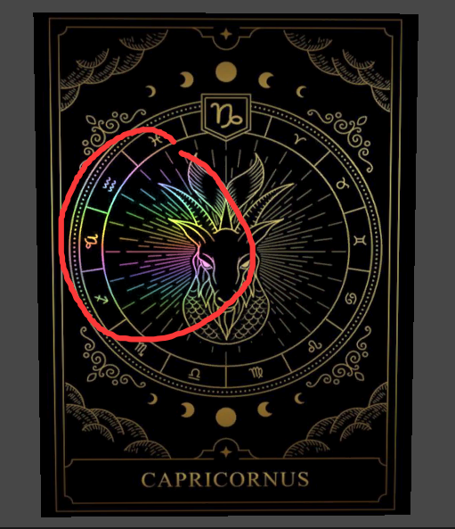

非常完美！

## 三.总结

实现过程并不复杂，核心原理就是在A的平面计算一个假的平面，他们之间存在一定的深度关系，不理解的话我也没办法了，好了本期结束！！！鼓掌！！！撒花！！！
