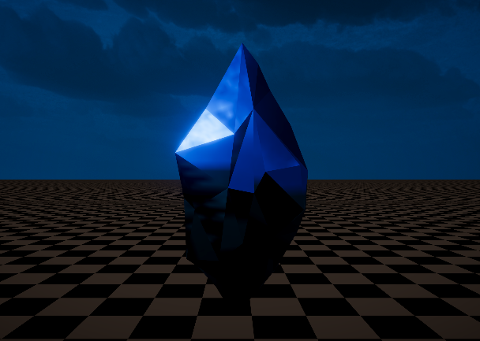
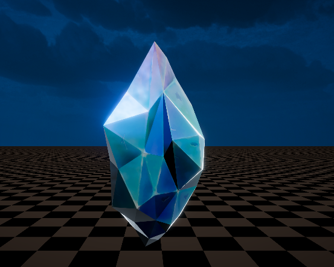

# 一、素材准备

相信各位大佬能够自己去3dmaxs中做一个晶石的模型，如果实在不会的话可以悄悄call我。

## 1.1贴图准备

主要也就用到两个cubemap贴图一张来做折射一张来做反射效果，反射的cubemap可以使用Reflection Probe来进行Baked。

# 二、Shader代码详解

主要使用双pass来分别制作折射反射效果和表面菲尼尔效果

## 2.1菲尼尔效果

这个不用我多说大家都知道原理是什么，就是1-dot(N,V)，然后我们通过power值、强度值和偏移值来控制菲尼尔效果的范围，强度与偏移量。

下面直接上代码：

```plain
half fresnel        = 1 - saturate(dot(VDir, NDir));
fresnel             = max(pow(fresnel, _F_Power), 0.00001) * _F_Intensity + _F_Bias;
```

效果如下图所示：


接下来是整个效果实现的核心也就是第二个pass，他主要实现的是晶石的折射与反射效果

## 2.2折射与反射效果

首先我们需要使用Reflection Probe来烘焙一张反射环境贴图，我们将采样这张烘焙的贴图来作为晶石反射的效果，让后我们采样skybox的cubemap来作为晶石的折射效果，当然我们可以模糊处理一下skybox的cubemap这样的到的效果会更加好一些，如何计算反射方向相信这也不用我多说了，我们将视角的反方向与法线方向传入reflect反射函数当中就能够得到我们的反射方向向量，接下来话不多说上代码：

```plain
half3 RDir          = reflect(-VDir, i.normalWS);
half4 Refra         = SAMPLE_TEXTURECUBE_LOD(_RefratTex, sampler_RefratTex, RDir, 0) * _RefratIntensity;
half4 Refle         = SAMPLE_TEXTURECUBE_LOD(_ReflectTex, sampler_ReflectTex, RDir, 0);
```

接下来看效果：



非常不错接下来我们将两个pass都加上，效果如下：



不错我们的效果实现了！！

下面是gif动态效果：


好吧建议看b站上传的mp4视频

# 三、完整代码展示

该效果主要是依靠双pass效果来分别实现菲涅尔与反射和折射效果的，反射与折射效果主要依靠Reflection Probe烘焙的反射环境贴图来表现效果的，话不多说上代码：

```plain
Shader "Test/jingshi"
{
    Properties
    {
        _MainTex("MainTex", 2D)                             = "white" {}
        _BaseColor("BaseColor", Color)                      = (1, 1, 1, 1)
        [HDR]_Color("Color_Back", Color)                    = (1, 1, 1, 1)
        _RefratTex("RefratTex", Cube)                       = "white" {}
        _RefratIntensity("RefratIntensity", Range(0, 5))    = 1
        _ReflectTex("ReflectTex", Cube)                     = "white" {}
        [HDR]_Color2("Color_Front", Color)                  = (1, 1, 1, 1)
        _F_Power("F_Power",Range(0, 20))                    = 1
        _F_Intensity("F_Intensity", Range(0,5))             = 1
        _F_Bias("F_Bias", Float)                            = 0
        [HDR]_F_Color("F_Color", Color)                     = (1, 1, 1, 1)
    }
    SubShader
    {
        Tags
        {
            "Queue" = "Transparent"
            "RenderType"="Transparent"
            "RenderPipeline" = "UniversalPipeline"
        }
        LOD 100

        Pass
        {
            Tags
            {
                "LightMode" = "UniversalForward"
            }
            //Blend SrcAlpha OneMinusSrcAlpha
            Blend one One
            //ZWrite off
            Cull Back
            
            HLSLPROGRAM
            #pragma vertex vert
            #pragma fragment frag
            
            #include "Packages/com.unity.render-pipelines.universal/ShaderLibrary/Core.hlsl"
            #include "Packages/com.unity.render-pipelines.universal/ShaderLibrary/Lighting.hlsl"

            CBUFFER_START(UnityPerMaterial)
                float4 _Color, _Color2, _F_Color, _BaseColor;
                float _RefratIntensity;
                float _F_Power, _F_Intensity, _F_Bias;
            CBUFFER_END

            TEXTURE2D(_MainTex);
            SAMPLER(sampler_MainTex);
            TEXTURECUBE(_RefratTex);
            SAMPLER(sampler_RefratTex);
            TEXTURECUBE(_ReflectTex);
            SAMPLER(sampler_ReflectTex);
            
            
            struct Attributes
            {
                float4 vertex       : POSITION;
                float2 texcoord     : TEXCOORD0;
                float3 normal       : NORMAL;
            };

            struct Varying
            {
                float4 posCS        : SV_POSITION;
                float2 uv           : TEXCOORD0;
                float4 posOS        : TEXCOORD1;
                float3 posWS        : TEXCOORD2;
                float3 posVS        : TEXCOORD3;
                float3 normalWS     : TEXCOORD4;
                float3 viewDirWS    : TEXCOORD5;
            };

            Varying vert (Attributes v)
            {
                Varying o           = (Varying)0;
                o.posOS             = v.vertex;
                o.posWS             = TransformObjectToWorld(o.posOS);
                o.posVS             = TransformWorldToView(o.posWS);
                o.posCS             = TransformWViewToHClip(o.posVS);
                o.uv                = v.texcoord;
                o.viewDirWS         = normalize(_WorldSpaceCameraPos - o.posWS);
                o.normalWS          = normalize(TransformObjectToWorldNormal(v.normal));
                return o;
            }

            half4 frag (Varying i) : SV_Target
            {
                half3 NDir          = normalize(i.normalWS);
                half3 VDir          = normalize(i.viewDirWS);
                half3 RDir          = reflect(-VDir, NDir);
                Light light         = GetMainLight();
                half3 LDir          = normalize(light.direction);
                half Diffuse        = saturate(dot(NDir,LDir));
                half fresnel        = 1 - saturate(dot(VDir, NDir));
                fresnel             = max(pow(fresnel, _F_Power), 0.00001) * _F_Intensity + _F_Bias;
                half4 Fre_Color     = fresnel * _F_Color;

                half4 Refra         = SAMPLE_TEXTURECUBE_LOD(_RefratTex, sampler_RefratTex, RDir, 0);
                half4 Refle         = SAMPLE_TEXTURECUBE_LOD(_ReflectTex, sampler_ReflectTex, RDir, 0) * fresnel;
                half4 MainTex       = SAMPLE_TEXTURE2D(_MainTex, sampler_MainTex, i.uv) * _BaseColor.rgba;
                half4 DiffuseCol    = Diffuse * MainTex;
                half4 color         = Refra * Refle * _Color2 + DiffuseCol;
                half4 final_col     = color + Fre_Color;
                return final_col;
            }
            ENDHLSL
        }
        Pass
        {
            Tags {"LightMode" = "SRPDefaultUnlit"}
            //Blend ScrAlpha OneMinusScrAlpha
            Blend Off
            //ZWrite on
            Cull Off
            HLSLPROGRAM

            #pragma vertex vert
            #pragma fragment frag

            #include "Packages/com.unity.render-pipelines.universal/ShaderLibrary/Core.hlsl"
            #include "Packages/com.unity.render-pipelines.universal/ShaderLibrary/Lighting.hlsl"

            CBUFFER_START(UnityPerMaterial)
                float4 _Color, _Color2;
                float _RefratIntensity;
            CBUFFER_END
            TEXTURECUBE(_RefratTex);
            SAMPLER(sampler_RefratTex);
            TEXTURECUBE(_ReflectTex);
            SAMPLER(sampler_ReflectTex);
            
            struct Attributes
            {
                float4 vertex       : POSITION;
                float2 texcoord     : TEXCOORD0;
                float3 normal       : NORMAL;
            };

            struct Varyings
            {
                float4 posCS        : SV_POSITION;
                float2 uv           : TEXCOORD0;
                float4 pos          : TEXCOORD1;
                float3 posWS        : TEXCOORD2;
                float3 posVS        : TEXCOORD3;
                float3 normalWS     : TEXCOORD4;
                float3 viewDirWS    : TEXCOORD5;
            };

            Varyings vert (Attributes v)
            {
                Varyings o          = (Varyings)0;
                o.pos               = v.vertex;
                o.posWS             = TransformObjectToWorld(o.pos);
                o.posVS             = TransformWorldToView(o.posWS);
                o.posCS             = TransformWViewToHClip(o.posVS);
                o.uv                = v.texcoord;
                o.normalWS          = normalize(TransformObjectToWorldNormal(v.normal));
                o.viewDirWS         = normalize(_WorldSpaceCameraPos - o.posWS);
                return o;
            }

            half4 frag (Varyings i) : SV_Target
            {
                half3 VDir          = normalize(i.viewDirWS);
                half3 RDir          = reflect(-VDir, i.normalWS);
                half4 Refra         = SAMPLE_TEXTURECUBE_LOD(_RefratTex, sampler_RefratTex, RDir, 0) * _RefratIntensity;
                half4 Refle         = SAMPLE_TEXTURECUBE_LOD(_ReflectTex, sampler_ReflectTex, RDir, 0);
                half4 color         = Refle * Refra * _Color;
                return color;
            }
            ENDHLSL
            
        }
    }
}

```
