:::tip
下面视频是新版优化后的ZZZShader
:::
<iframe width="100%" height="468" src="//player.bilibili.com/player.html?bvid=BV1MHhHzqEok" scrolling="no" border="0" frameborder="no" framespacing="0" allowfullscreen="true"> </iframe>

:::warning
该文章只是从我的旧博客以及语雀笔记上迁移，目前已经迭代过一个版本，该文章版本已经过时，仅供参考，新版的文档可能后续会更新(待定)
:::

## 1.开始前工作

如果使用的是模之屋的mmd模型请在blender中处理模型，将模型中相同材质的部分合并为一个材质，并且将模型的面部有关形态键的部分单独拆成一个网格体，当然也可以拆的更细一些比如将眼睛单独拆出可以用来做透视，头发单独拆开，不会拆的请自行找教程！！

### 贴图准备

找不到贴图怎么办？请到上海市徐汇区苍梧路519号光启园四期1号楼去要，记得声音要尖锐点不然可能要不到  
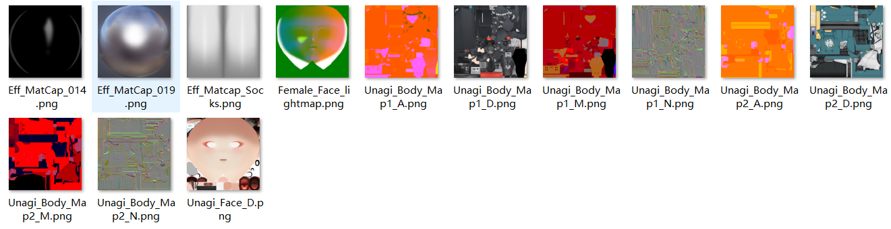

### 关闭贴图压缩

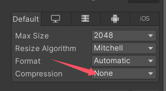

### 面部光照图去SRGB

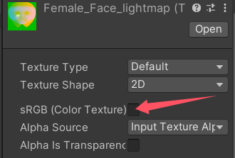

### 各类遮罩图也需要去SRGB

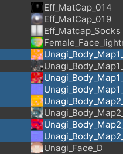

## 2.Shader处理 （BaseShader部分）

### 添加KeywordEnum对各个部分进行区分，具体参数请看下面代码

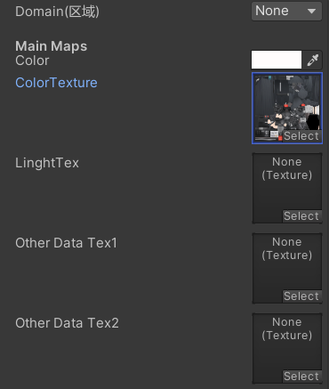

```plain
//添加KeywordEnum对各个部分进行区分，添加贴图参数和颜色混合参数
[KeywordEnum(None, Face, Eye, Body)] _Domain("Domain(区域)", Float) = 0

//基本贴图，并禁止缩放和偏移（防止蠢蛋美术瞎搞）
[Header(Main Maps)] 
_Color("Color", Color) = (1, 1, 1, 1)
[NoScaleOffset] _MainTex("ColorTexture",2D) = "White"{}
[NoScaleOffset] _LightTex("LinghtTex", 2D) = "White"{}
[NoScaleOffset] _OtherDataTex1("Other Data Tex1",2D) = "White"{}
[NoScaleOffset] _OtherDataTex2("Other Data Tex2",2D) = "White"{}
```

### 定义Keyword 宏

常量放常量缓冲区，采样贴图需要额外定义采样器

```plain
#pragma shader_feature_local _DOMAIN_FACE
#pragma shader_feature_local _DOMAIN_EYE
#pragma shader_feature_local _DOMAIN_BODY
```

### 定义参数变量

```plain
// 定义纹理
TEXTURE2D (_MainTex);
// 定义纹理采样器
SAMPLER(sampler_MainTex);

TEXTURE2D (_LightTex);
SAMPLER(sampler_LightTex);

TEXTURE2D (_OtherDataTex1);
SAMPLER(sampler_OtherDataTex1);

TEXTURE2D (_OtherDataTex2);
SAMPLER(sampler_OtherDataTex2);
```

### 定义输入结构体

```plain
// 定义输入结构体 appdata to Vertex
struct UniversalAttributes
{
    float4 positionOS   :POSITION;
    float3 normalOS     :NORMAL;
    float4 tangentOS    :TANGENT;
    float2 texcoord     :TEXCOORD0;

};
```

### 定义顶点输出结构体

```plain
// 定义输出结构体 Vertex to frag
struct UniversalVaryings 
{
    float4 positionCS               :SV_POSITION;
    float4 positionWSAndFogFactor   :TEXCOORD0;
    float2 uv                       :TEXCOORD1;
    float3 normalWS                 :TEXCOORD2;
    float4 tangentWS                :TEXCOORD3;
    float3 viewDirWS                :TEXCOORD4;

};
```

### 定义主顶点着色器函数

```plain
UniversalVaryings MainVS(UniversalAttributes input)
{
    //获取世界空间下法线和位置等信息
    VertexPositionInputs positionInputs = GetVertexPositionInputs(input.positionOS.xyz);
    VertexNormalInputs normalInputs = GetVertexNormalInputs(input.normalOS, input.tangentOS);

    UniversalVaryings output;
    output.positionCS = positionInputs.positionCS;
    output.positionWSAndFogFactor = float4(positionInputs.positionWS, ComputeFogFactor(positionInputs.positionCS.z));
    output.normalWS = normalInputs.normalWS;
    
    output.tangentWS.xyz = normalInputs.tangentWS;
    output.tangentWS.w = input.tangentOS.w * GetOddNegativeScale();
    // unity_OrthoParams.w判断是透视还是正交
    output.viewDirWS = unity_OrthoParams.w == 0 ? GetCameraPositionWS() - positionInputs.positionWS : GetWorldToViewMatrix()[2].xyz;

    output.uv = input.texcoord;

    return output;

}
```

### 定义主片元着色器函数

```plain
float4 MainPS(UniversalVaryings input, bool isFrontFace : SV_IsFrontFace):SV_TARGET
{
    float4 var_MainTex = SAMPLE_TEXTURE2D(_MainTex,sampler_MainTex,input.uv);
    var_MainTex *= _Color;

    float3 baseCol = var_MainTex.rgb;
    float baseAlpha = 1.0;

    #if _DOMAIN_BODY || _DOMAIN_EYE
    {
        baseAlpha = var_MainTex.a;
    }
    return float4(baseCol, baseAlpha);
    #endif
}   
```

### Pass部分

```plain
{
    Name"Base Pass"
    //Name"UniversalForward"
    
    Tags{
        "LightMode" = "UniversalForward"
    }
    // HLSL程序段
    HLSLPROGRAM
    #pragma vertex MainVS
    #pragma fragment MainPS
    #pragma multi_compile_fog
    ENDHLSL

}
```

## 3.Shader处理 （OutlineShader部分）

### 参数增加

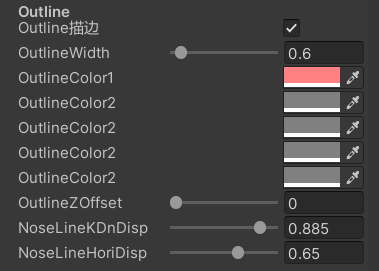

```plain
[Header(Outline)]
[Toggle(_OUTLINE_PASS)] _Outline("Outline描边", int) = 0
_OutlineWidth("OutlineWidth", Range(0, 10)) = 1
_OutlineColor1("OutlineColor1",  Color) = (0, 0, 0, 1)
_OutlineColor2("OutlineColor2",  Color) = (0, 0, 0, 1)
_OutlineColor3("OutlineColor2",  Color) = (0, 0, 0, 1)
_OutlineColor4("OutlineColor2",  Color) = (0, 0, 0, 1)
_OutlineColor5("OutlineColor2",  Color) = (0, 0, 0, 1)
_OutlineZOffset("OutlineZOffset", Range(0, 1)) = 0.01
_NoseLineKDnDisp("NoseLineKDnDisp", Range(0, 1)) = 0.5
_NoseLineHoriDisp("NoseLineHoriDisp", Range(0, 1)) = 0.5
```

### Pass内声明

```plain
 {
    Name"Outline Pass"
    Tags{
        "LightMode" = "UniversalForwardOnly"
    }
    Cull Front
    //ZWrite On
    // HLSL程序段
    HLSLPROGRAM
    #pragma shader_feature_local _OUTLINE_PASS
    
    #pragma vertex vert
    #pragma fragment frag
    #pragma multi_compile_fog
    
    #include "OutLinePass.hlsl"
    ENDHLSL
}
```

### 这里获取了模型第二套UV,里面是平滑法线数据

```plain
// 定义输入结构体 appdata to Vertex
struct Attributes
{
    float4 positionOS   :POSITION;
    float3 normalOS     :NORMAL;
    float4 tangentOS    :TANGENT;
    float2 texcoord0    :TEXCOORD0;
    float2 texcoord1    :TEXCOORD1;

};
```

float2 texcoord1    :TEXCOORD1;(平滑法线数据)

```plain
// 定义输出结构体 Vertex to frag
struct Varyings 
{
    float4 positionCS :SV_POSITION;
    float FogFactor   :TEXCOORD0;
    float2 uv         :TEXCOORD1;
};
```

### 描边缩放函数（使用Colin的算法代码）

```plain
//限制描边宽度
// If your project has a faster way to get camera fov in shader, you can replace this slow function to your method.
// For example, you write cmd.SetGlobalFloat("_CurrentCameraFOV",cameraFOV) using a new RendererFeature in C#.
// For this tutorial shader, we will keep things simple and use this slower but convenient method to get camera fov
float GetCameraFOV()
{
    //https://answers.unity.com/questions/770838/how-can-i-extract-the-fov-information-from-the-pro.html
    float t = unity_CameraProjection._m11;
    float Rad2Deg = 180 / 3.1415;
    float fov = atan(1.0f / t) * 2.0 * Rad2Deg;
    return fov;
}
float ApplyOutlineDistanceFadeOut(float inputMulFix)
{
    //make outline "fadeout" if character is too small in camera's view
    return saturate(inputMulFix);
}
float GetOutlineCameraFovAndDistanceFixMultiplier(float positionVS_Z)
{
    float cameraMulFix;
    if(unity_OrthoParams.w == 0)
    {
        ////////////////////////////////
        // Perspective camera case
        ////////////////////////////////

        // keep outline similar width on screen accoss all camera distance       
        cameraMulFix = abs(positionVS_Z);

        // can replace to a tonemap function if a smooth stop is needed
        cameraMulFix = ApplyOutlineDistanceFadeOut(cameraMulFix);

        // keep outline similar width on screen accoss all camera fov
        cameraMulFix *= GetCameraFOV();       
    }
    else
    {
        ////////////////////////////////
        // Orthographic camera case
        ////////////////////////////////
        float orthoSize = abs(unity_OrthoParams.y);
        orthoSize = ApplyOutlineDistanceFadeOut(orthoSize);
        cameraMulFix = orthoSize * 50; // 50 is a magic number to match perspective camera's outline width
    }

    return cameraMulFix * 0.00005; // mul a const to make return result = default normal expand amount WS
}
// Push an imaginary vertex towards camera in view space (linear, view space unit), 
// then only overwrite original positionCS.z using imaginary vertex's result positionCS.z value
// Will only affect ZTest ZWrite's depth value of vertex shader

// Useful for:
// -Hide ugly outline on face/eye
// -Make eyebrow render on top of hair
// -Solve ZFighting issue without moving geometry

```

### 法线外扩

法线外扩需要读取第二套UV的平滑法线信息  
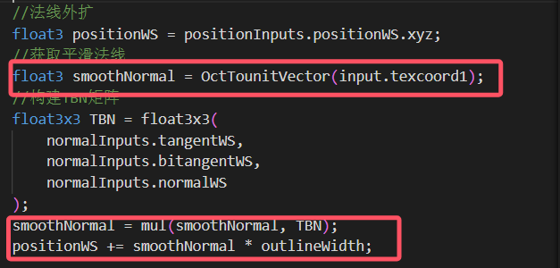

### 八面体映射读取函数

```plain
//从UV读取平滑法线
//2维转3维
float3 OctTounitVector(float2 oct)
{
    //还原了未折叠时的 3D 坐标
    //N = float3(oct.x, oct.y, 1 - abs(oct.x) - abs(oct.y))
    float3 N = float3(oct, 1 - dot(1, abs(oct)));
    // 检测是否折叠（z为负数时
    float t = max(-N.z, 0);
    N.x += N.x >= 0? (-t) : t;
    N.y += N.y >= 0? (-t) : t;
    return normalize(N);
}
```

### 这里需要裁剪空间下描边顶点Z轴方向偏移，代码来自于Colin

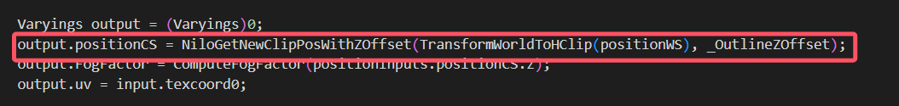

```plain
float4 NiloGetNewClipPosWithZOffset(float4 originalPositionCS, float viewSpaceZOffsetAmount)
{
    if(unity_OrthoParams.w == 0)
    {
        ////////////////////////////////
        //Perspective camera case
        ////////////////////////////////
        float2 ProjM_ZRow_ZW = UNITY_MATRIX_P[2].zw;
        float modifiedPositionVS_Z = -originalPositionCS.w + -viewSpaceZOffsetAmount; // push imaginary vertex
        float modifiedPositionCS_Z = modifiedPositionVS_Z * ProjM_ZRow_ZW[0] + ProjM_ZRow_ZW[1];
        originalPositionCS.z = modifiedPositionCS_Z * originalPositionCS.w / (-modifiedPositionVS_Z); // overwrite positionCS.z
        return originalPositionCS;    
    }
    else
    {
        ////////////////////////////////
        //Orthographic camera case
        ////////////////////////////////
        originalPositionCS.z += -viewSpaceZOffsetAmount / _ProjectionParams.z; // push imaginary vertex and overwrite positionCS.z
        return originalPositionCS;
    }
}
```

### 描边顶点着色器函数

```plain
// 顶点着色器函数
Varyings vert(Attributes input)
{
    #if !_OUTLINE_PASS
    return  (Varyings)0;
    #endif
    //获取世界空间下法线和位置等信息
    VertexPositionInputs positionInputs = GetVertexPositionInputs(input.positionOS.xyz);
    VertexNormalInputs normalInputs = GetVertexNormalInputs(input.normalOS, input.tangentOS);
    //描边宽度
    float outlineWidth = _OutlineWidth;
    //描边宽度随相机深度进行缩放
    outlineWidth *= GetOutlineCameraFovAndDistanceFixMultiplier(positionInputs.positionVS.z);
    
    //法线外扩
    float3 positionWS = positionInputs.positionWS.xyz;
    //获取平滑法线
    float3 smoothNormal = OctTounitVector(input.texcoord1);
    //构建TBN矩阵
    float3x3 TBN = float3x3(
        normalInputs.tangentWS,
        normalInputs.bitangentWS,
        normalInputs.normalWS
    );
    smoothNormal = mul(smoothNormal, TBN);
    positionWS += smoothNormal * outlineWidth;

    Varyings output = (Varyings)0;
    output.positionCS = NiloGetNewClipPosWithZOffset(TransformWorldToHClip(positionWS), _OutlineZOffset);
    output.FogFactor = ComputeFogFactor(positionInputs.positionCS.z);
    output.uv = input.texcoord0;

    return output;

}
```

这里需要读取R通道，里面是存的材质ID  
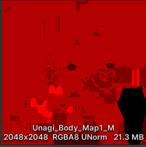  
R通道  
添加ID选择通用的函数宏  
这里定义了4个函数宏，两个“##”表示拼接  
TYPE

TYPE##2

TYPE##3

TYPE##4  
分别对应 1维到4维数据类型，同时在下面进行函数声明

```plain
#define DEFINE_SELECT(TYPE)\
TYPE select(int id, TYPE e0, TYPE e1, TYPE e2, TYPE e3, TYPE e4)    {return TYPE(id > 0 ? (id > 1 ? (id > 2 ? (id > 3 ? e4 : e3) : e2) : e1) : e0);}\
TYPE##2 select(int id, TYPE##2 e0, TYPE##2 e1, TYPE##2 e2, TYPE##2 e3, TYPE##2 e4)  {return TYPE##2(id > 0 ? (id > 1 ? (id > 2 ? (id > 3 ? e4 : e3) : e2) : e1) : e0);}\
TYPE##3 select(int id, TYPE##3 e0, TYPE##3 e1, TYPE##3 e2, TYPE##3 e3, TYPE##3 e4)  {return TYPE##3(id > 0 ? (id > 1 ? (id > 2 ? (id > 3 ? e4 : e3) : e2) : e1) : e0);}\
TYPE##4 select(int id, TYPE##4 e0, TYPE##4 e1, TYPE##4 e2, TYPE##4 e3, TYPE##4 e4)  {return TYPE##4(id > 0 ? (id > 1 ? (id > 2 ? (id > 3 ? e4 : e3) : e2) : e1) : e0);}

DEFINE_SELECT(bool)
DEFINE_SELECT(uint)
DEFINE_SELECT(int)
DEFINE_SELECT(float)
DEFINE_SELECT(half)
```

最后进行输出  
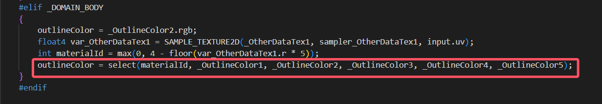

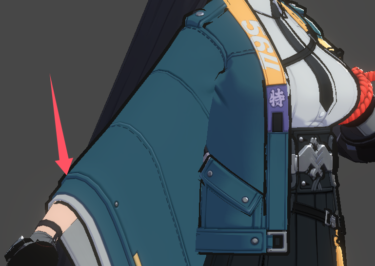

描边颜色x0.2压暗，除了面部为FF8181,其余先调成555555  
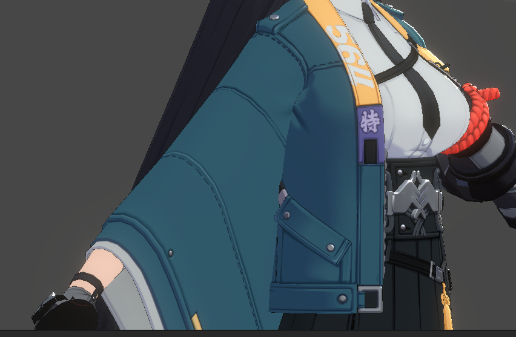

### 描边片元着色器函数

这里进行描边的染色，需要针对不同区域进行不同染色

```plain
// 片元着色器函数
float4 frag(Varyings input):SV_Target
{
    #if !_OUTLINE_PASS
    clip(-1);
    #endif
    float3 outlineColor = 0;

    #if _DOMAIN_FACE
    {
        outlineColor = _OutlineColor1.rgb;
    }
    #elif _DOMAIN_BODY
    {
        outlineColor = _OutlineColor2.rgb;
        float4 var_OtherDataTex1 = SAMPLE_TEXTURE2D(_OtherDataTex1, sampler_OtherDataTex1, input.uv);
        int materialId = max(0, 4 - floor(var_OtherDataTex1.r * 5));
        outlineColor = select(materialId, _OutlineColor1, _OutlineColor2, _OutlineColor3, _OutlineColor4, _OutlineColor5);
    }
    #endif

    outlineColor *= 0.2;
    
    float4 color = float4(outlineColor, 1);
    color.rgb = MixFog(color.rgb, input.FogFactor);
    return color;
}
```

## Shader构建

### 着色阶段

获取法线和顶点位置并进行归一化

```plain
float3 normalWS = normalize(input.normalWS);
float3 positionWS = input.positionWSAndFogFactor.xyz;
```

#### 获取ShadowCoord和光线向量

```plain
//获取shadowCoord和光向量
float4 shadowCoord = TransformWorldToShadowCoord(positionWS);
Light mainLight = GetMainLight(shadowCoord);
float3 lightDirectionWS = normalize(mainLight.direction);
```

#### 计算光线衰减（兰伯特）

```plain
//光线衰减
float baseAttenuation = 1.0;
{
    //兰伯特
    float NoL = dot(pixelNormalWS, lightDirectionWS);
    baseAttenuation = NoL + diffuseBias;
}
```

我们看一下效果  
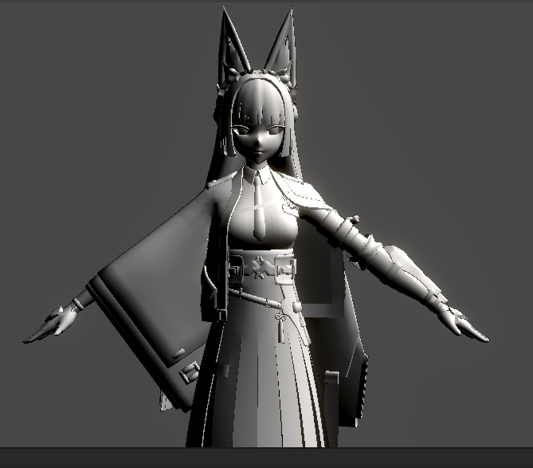可以看到细节还有不够

下面我们来添加法线和漫反射偏移  
法线贴图是这几张图，法线在RG通道，B通道是漫反射偏移，其实就是增亮暗部的颜色

R通道  
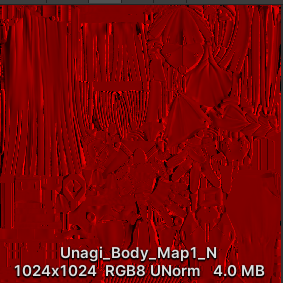  
G通道  
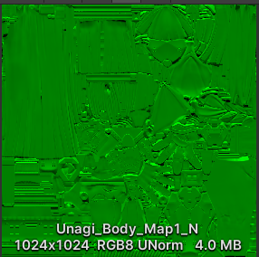  
B通道  
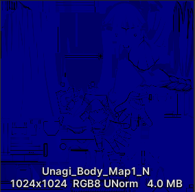

#### 法线解析和漫反射偏移

##### TBN矩阵参数计算

```plain
//计算TBN矩阵
float sign = input.tangentWS.w;
float3 tangentWS = normalize(input.tangentWS.xyz);
float3 bitangentWS = sign * cross(normalWS, tangentWS);
```

##### 法线翻转值

sign 是控制法线翻转的值，之前顶点着色器传入的值就存在tangent的w分量中

```plain
output.tangentWS.xyz = normalInputs.tangentWS;
output.tangentWS.w = input.tangentOS.w * GetOddNegativeScale();
```

##### 初始化变量

```plain
float3 pixelNormalWS = normalWS;
//漫反射偏移
float diffuseBias = 0;
```

##### 身体部分，进行法线解析和漫反射偏移处理

```plain
 #if _DOMAIN_BODY
{
    //RG是法线，B是漫反射偏移
    float4 var_lightTex = SAMPLE_TEXTURE2D(_LightTex, sampler_LightTex, input.uv);
    //映射到-1~1
    var_lightTex = var_lightTex * 2.0 - 1.0;
    //漫反射偏移
    diffuseBias = var_lightTex.z * 2.0;
    
    //解析法线
    float3 pixelNormalTS = float3(var_lightTex.xy, 0.0);
    pixelNormalTS.xy *= _BumpScale;
    pixelNormalTS.z = sqrt(1.0 - min(1, dot(pixelNormalTS.xy, pixelNormalTS.xy)));
    pixelNormalWS = TransformTangentToWorld(pixelNormalTS, float3x3(tangentWS, bitangentWS, normalWS));
    pixelNormalWS = normalize(pixelNormalWS);
}
 #endif
```

这里法线只有XY两个值，所以我们需要计算Z向量的值 _BumpScale新增参数控制法线强度 对于法线，各个向量的平方相加应该等于1，由此可以求出Z方向数值  
因为浮点计算误差问题X和Y的平方和可能超过1，所以使用Min进行防范 最后使用TBN矩阵进行转换然后归一化

#### 混合输出测试看效果

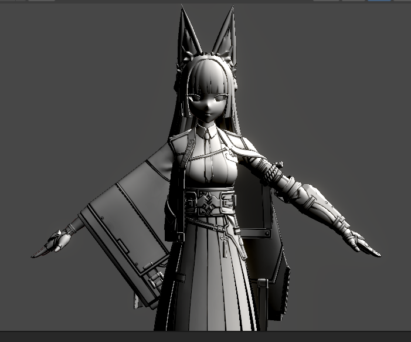  
当当！细节效果是不是有了

#### 最后处理一下背面法线

```plain
//处理背面法线
normalWS *= isFrontFace ? 1 : -1;
pixelNormalWS *= isFrontFace ? 1 : -1;
```

### 光照分级

#### 添加分级参数

这里设置参数和初始化

```plain
//定义光滑度
float albedoSmoothness = max(1e-5, _AlbedoSmoothness);
float albedoShadowFade = 1.0;       //较深阴影 
float albedoShadow = 1.0;           //较浅阴影
float albedoShallowFade = 1.0;      //中间过渡部分较深阴影
float albedoShallow = 1.0;          //中间过渡部分较浅阴影
float albedoSSS = 1.0;              //中间过渡部分较浅阴影向上偏移出的次表面部分
float albedoFront = 1.0;            //最亮区域，接近没有衰减的部分
float albedoForward = 1.0;          //最强反射部分
```

#### 定义光滑系数和锐利系数

锐利系数也可以叫做粗糙度，锐利系数 = 1 - 光滑系数

```plain
float attenuation = baseAttenuation * 1.5; //-1.5 ~ 1.5  
//光滑度系数调整
float s0 = albedoSmoothness * 1.5; // 0 ~ 1.5
//锐利系数
float s1 = 1.0 - s0; // -0.5 ~ 1
```

#### 分级操作

```plain
//将明暗分为6个部分 每0.5一段 1.5 ~ -1 
float aRamp[6] = {
    (attenuation + 1.5) / s1 + 0.0,     //aRamp[0] 强光衰减部分，表示最强的衰减和最深的阴影的负值
    (attenuation + 0.5) / s0 + 0.5,     //aRamp[1] 相对较弱的衰减，表征较浅的阴影。
    (attenuation + 0.0) / s1 + 0.5,     //aRamp[2] 中等衰减，逐渐过渡到正常的阴影
    (attenuation - 0.5) / s0 + 0.5,     //aRamp[3] 较弱衰减，较弱阴影区域
    (attenuation - 0.5) / s0 - 0.5,     //aRamp[4] 衰减较少，代表反射或光照强度较强次表面的区域
    (attenuation - 2.0) / s1 + 1.5,     //aRamp[5] 最亮区域，接近没有衰减的部分
};
albedoShadowFade = saturate(1 - aRamp[0]);                  //较深阴影
albedoShadow = saturate(min(1 - aRamp[1], aRamp[0]));       //较浅阴影
albedoShallowFade = saturate(min(1 - aRamp[2], aRamp[1]));  //中间过渡部分较深阴影
albedoShallow = saturate(min(1 - aRamp[3], aRamp[2]));      //中间过渡部分较浅阴影
albedoSSS = saturate(min(1 - aRamp[4], aRamp[3]));          //中间过渡部分较浅阴影偏移出的次表面部分
albedoFront = saturate(min(1 - aRamp[5], aRamp[4]));        //明亮区域，接近没有衰减的部分
albedoForward = saturate(aRamp[5]);      
```

#### 分区公式理解

分区公式，不用管下标i
$$
aRamp[i] = \frac{attenuation + offset_i} {s_i} + 0.5
$$

##### Offset参数设计

Attenuation的范围是-1.5~1.5,这个跨度是3，如果我分6层进行平均分配的话就是3/6=0.5，所以offset这里偏移值应当是0.5的倍数

##### attenuation的范围是-1.5~1.5

#### 缩放因子的选择

然后是看S0和S1两个参数的使用，第一层是使用的S1,光滑度控制，而S0则是1-光滑度即锐利系数，这里我们先分析，这个光滑度的作用是什么 这是attenuation / _AlbedoSmoothness 这里可以发现中间的分界线变硬了，这是因为除以一个小数，数值会变大，结果而言就是负数变得更小，正数变得更大，所以对比变得更强烈，也就是数值越小越硬（范围变小），数值越大越软（范围变大） 还要一个重要的点是收缩方向，收缩的方向是双向的，只是小于0都是黑色所以看不出来 这里使用的是 S0 =_AlbedoSmoothness，若是换成S1则相反，数值越大越软（范围变大），数值越小越硬（范围变小）  
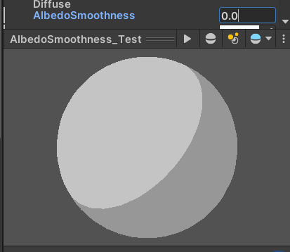

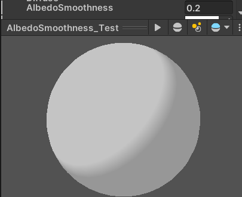

这里假设，0 ~ 2/6是第一层的部分，范围是0~1，因为需要满足能量守恒相加为一切保证两段连续，所以第二层在物体的2/6处必须为0，这样可以保证连续，而对于软硬控制，如果使用同一参数，就会导致中间链接的地方向两侧拉开，就会导致不连续，所以两层之间需要使用不同的混合，一个进行外扩的时候另一个同步进行压缩，这也是为什么需要使用S0和S1

#### 各个分量预览

##### albedoShadowFade最深阴影

最深的阴影部分就是光照衰减最大的部分，也就是1 - aRamp[0]

```plain
albedoShadowFade = saturate(1 - aRamp[0]);   //较深阴影
```

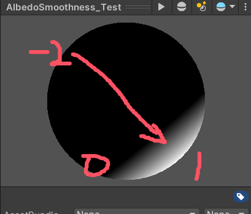

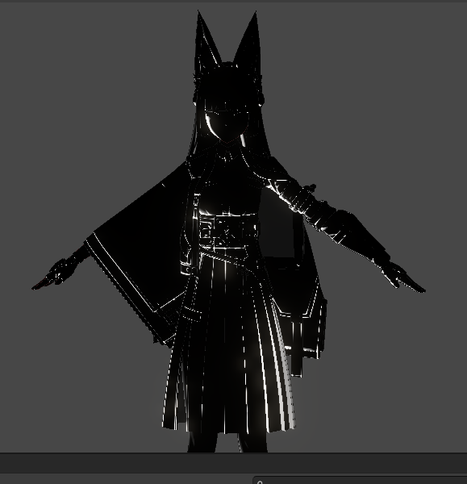

##### albedoShadow较浅阴影

min(1 - aRamp[1], aRamp[0])这里进行处理与第一层重叠过渡的部分和排除重叠的部分，albedoShadow最终输出

```plain
albedoShadow = saturate(min(1 - aRamp[1], aRamp[0]));       //较浅阴影
```

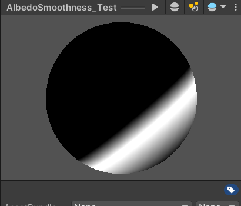

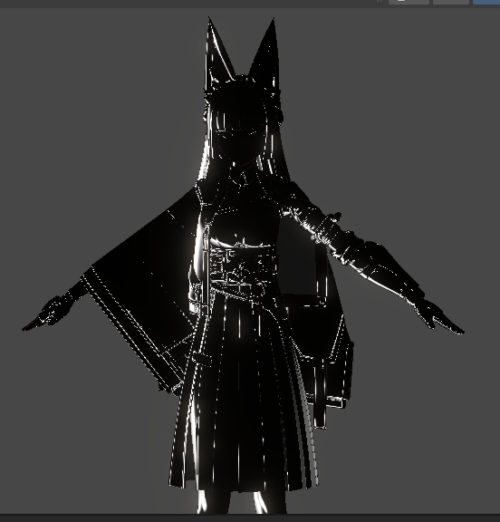

##### albedoShallowFade中间过渡较深阴影

这里是albedoShallowFade输出，这里使用的是S1，min(1 - aRamp[2], aRamp[1])对重叠部分和两层中间过渡部分进行处理

```plain
albedoShallowFade = saturate(min(1 - aRamp[2], aRamp[1]));  //中间过渡部分较深阴影
```

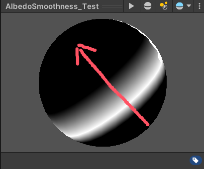

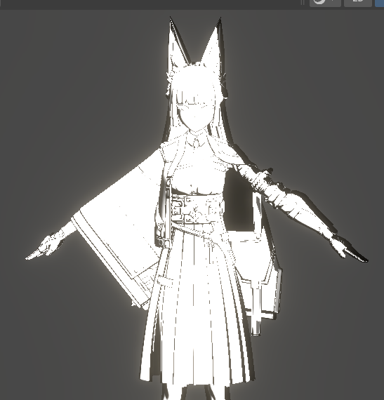

##### albedoShallow中间过渡较浅阴影

这里是 albedoShallow输出，min(1 - aRamp[3], aRamp[2])对重叠部分和两层中间过渡部分进行处理

```plain
albedoShallow = saturate(min(1 - aRamp[3], aRamp[2]));      //中间过渡部分较浅阴影
```

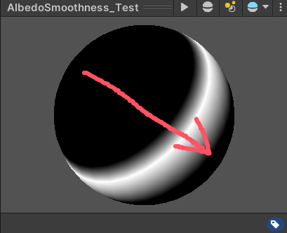

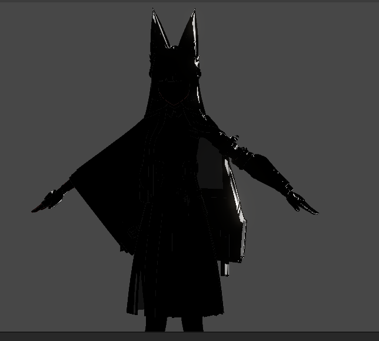

##### albedoSSS次表面部分

阴影层已经分完了，现在这里是次表面部分次表面部分应该是在光照部分和阴影部分之间，阴影越硬次表面就应该也越硬也就是越不明显，这里用S0和上一层相同的软硬控制相当于增强阴影层和光照层的  
对应aRamp第五行：衰减程度未改变为attenuation - 0.5，然后受光滑系数影响，阴影范围偏移为-0.5

```plain
albedoSSS = saturate(min(1 - aRamp[4], aRamp[3]));//中间过渡部分较浅阴影偏移出的次表面部分albedoSSS = saturate(min(1 - aRamp[4], aRamp[3]));          //中间过渡部分较浅阴影偏移出的次表面部分
```

albedoSSS预览，因为使用的是和上一层相同的S0,当_AlbedoSmoothness为0时，是全黑的

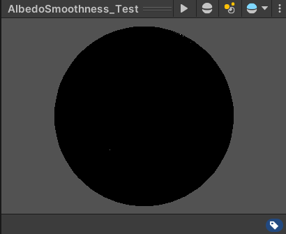

稍微增大_AlbedoSmoothness，边缘变软就出现了区域

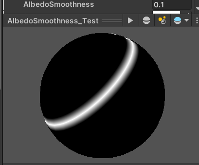

模型的_AlbedoSmoothness为0.1

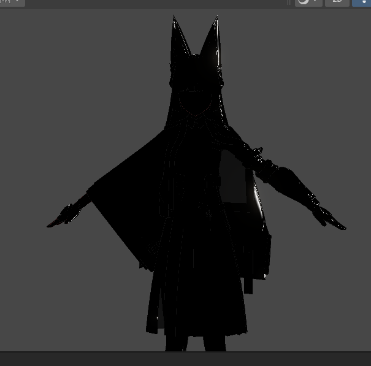

##### SSS和albedoShallow一起输出

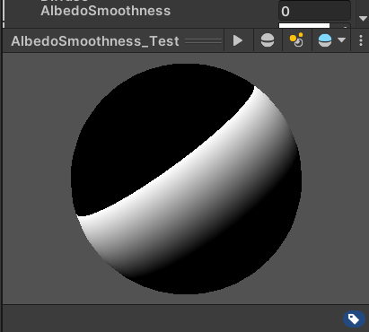

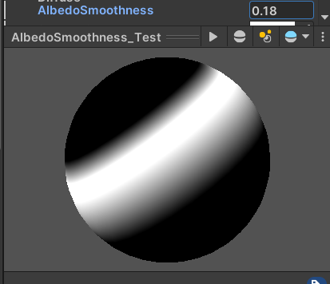

##### albedoFront 明亮区域，接近没有衰减

对应aRamp第六行：衰减程度改变为attenuation - 2.0相当于无衰减，然后受光滑系数影响

```plain
albedoFront = saturate(min(1 - aRamp[5], aRamp[4]));//明亮区域，接近没有衰减的部分
```

albedoFront预览，这里使用的S1，min(1 - aRamp[5], aRamp[4])处理和SSS重叠的部分

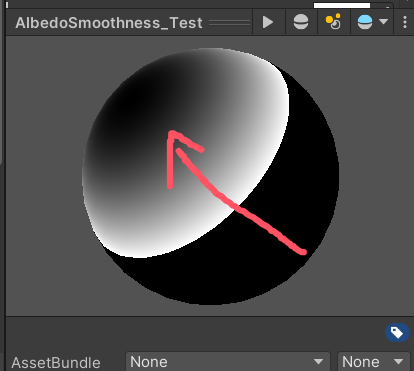

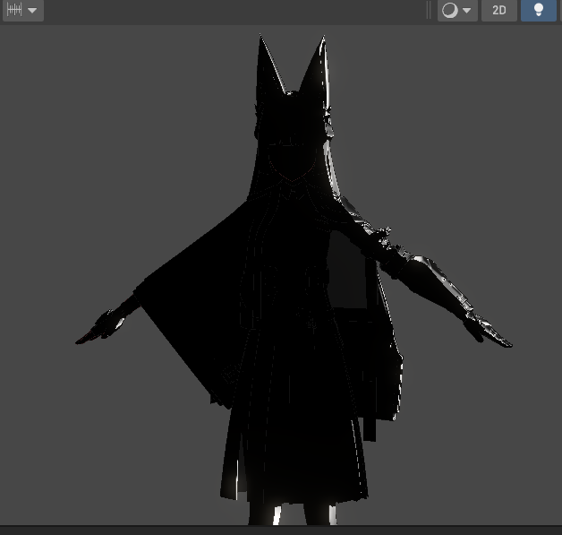

##### albedoForward 最强反射部分,没有衰减

对应aRamp第六行：衰减程度改变为attenuation - 2.0相当于无衰减，然后受光滑系数影响，阴影范围偏移为+1.5，取这个值就是最强反射的部分

```plain
albedoForward = saturate(aRamp[5]);////最强反射部分
```

albedoForward预览，这里使用的S1因为和albedoFront同属一组是连续的

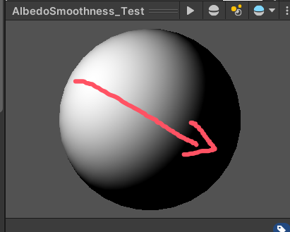

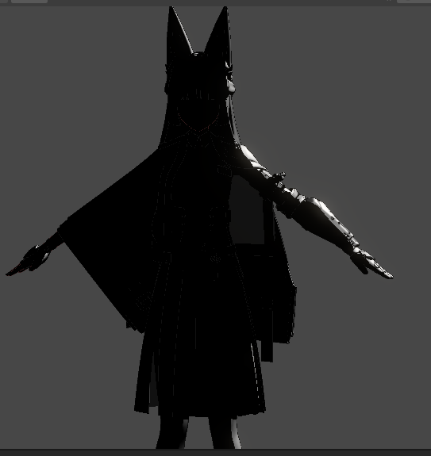

### 能量守恒

分层之后，各个值加起来应该等于1，所以需要进行判断

```plain
//能量守恒 累加等于1 abs经验性将权重控制为1，没有经过半球积分验证
float a = abs(albedoShadowFade + albedoShadow + albedoShallowFade + albedoShallow + albedoSSS + albedoFront + albedoForward - 1.0) < 0.01;
```

### 分层着色

#### 材质ID初始化

```plain
//材质索引
int materialId = 0;
```

#### 读取贴图数据获得材质ID

```plain
//材质索引
float4 var_OtherDataTex1 =  SAMPLE_TEXTURE2D(_OtherDataTex1, sampler_OtherDataTex1, input.uv);
materialId = max(0, 4 - floor(var_OtherDataTex1.r * 5));
```

#### 初始化颜色变量

```plain
//定义光滑度
float albedoSmoothness = max(1e-5, _AlbedoSmoothness);

float albedoShadowFade = 1.0;       //较深阴影 
float albedoShadow = 1.0;           //较浅阴影
float albedoShallowFade = 1.0;      //中间过渡部分较深阴影
float albedoShallow = 1.0;          //中间过渡部分较浅阴影
float albedoSSS = 1.0;              //中间过渡部分较浅阴影向上偏移出的次表面部分
float albedoFront = 1.0;            //最亮区域，接近没有衰减的部分
float albedoForward = 1.0;          //最强反射部分
```

#### 参数追加

```plain
[Header(Diffuse)]
_AlbedoSmoothness("AlbedoSmoothness", Float) = 1.0
_ShallowColor1("ShallowColor1",  Color) = (1, 1, 1, 1)
_ShallowColor2("ShallowColor2",  Color) = (1, 1, 1, 1)
_ShallowColor3("ShallowColor3",  Color) = (1, 1, 1, 1)
_ShallowColor4("ShallowColor4",  Color) = (1, 1, 1, 1)
_ShallowColor5("ShallowColor5",  Color) = (1, 1, 1, 1)

_ShadowColor1("ShadowColor1",  Color) = (1, 1, 1, 1)
_ShadowColor2("ShadowColor2",  Color) = (1, 1, 1, 1)
_ShadowColor3("ShadowColor3",  Color) = (1, 1, 1, 1)
_ShadowColor4("ShadowColor4",  Color) = (1, 1, 1, 1)
_ShadowColor5("ShadowColor5",  Color) = (1, 1, 1, 1)

_PostShallowTint("PostShallowTint",  Color) = (1, 1, 1, 1)
_PostShallowFadeTint("PostShallowFadeTint",  Color) = (1, 1, 1, 1)

_PostShadowTint("PostShadowTint",  Color) = (1, 1, 1, 1)
_PostShadowFadeTint("PostShadowFadeTint",  Color) = (1, 1, 1, 1)
_PostSssTint("PostSssTint",  Color) = (1, 1, 1, 1)
_PosFrontTint("PosFrontTint",  Color) = (1, 1, 1, 1)
```

### 新增函数

这里对颜色归一化其实是进行提亮操作，根据深度来判断是否提亮，当视角越近亮度就越高，越原就越解决原色

#### 平均颜色亮度与归一化

```plain
//平均颜色亮度
float AverageColor(float3 color)
{
return dot(color, float3(1.0, 1.0, 1.0)) / 3;
}
//颜色归一化，这里归一化会使颜色变亮
float3 NormalizeColorByAverageColor(float3 color)
{
float average = AverageColor(color);
return color / max(average, 1e-5);
}
```

#### 限制灯光颜色亮度

这里对灯光进行压暗操作，当灯光亮度不超过1的时候进行缩放，获得一个低亮度的灯光颜色用于阴影处理，而非阴影部分使用不处理的灯光颜色

```plain
//限制灯光颜色亮度
float3 ScaleColorByMax(float3 color)
{
float maxComponent = max3(color.r, color.g, color.b);
maxComponent = min(maxComponent, 1.0);
return float3(color * maxComponent);
}
```

### 三值比较函数宏模版

```plain
#define DEFINE_MINMAX3(TYPE)\
TYPE min3(TYPE a, TYPE b, TYPE c) {return TYPE(min(min(a, b), c));}\
TYPE##2 min3(TYPE##2 a, TYPE##2 b, TYPE##2 c) {return TYPE##2(min(min(a, b), c));}\
TYPE##3 min3(TYPE##3 a, TYPE##3 b, TYPE##3 c) {return TYPE##3(min(min(a, b), c));}\
TYPE##4 min3(TYPE##4 a, TYPE##4 b, TYPE##4 c) {return TYPE##4(min(min(a, b), c));}\
TYPE max3(TYPE a, TYPE b, TYPE c){return TYPE(max(max(a, b), c));}\
TYPE##2 max3(TYPE##2 a, TYPE##2 b, TYPE##2 c) {return TYPE##2(max(max(a, b), c));}\
TYPE##3 max3(TYPE##3 a, TYPE##3 b, TYPE##3 c) {return TYPE##3(max(max(a, b), c));}\
TYPE##4 max3(TYPE##4 a, TYPE##4 b, TYPE##4 c) {return TYPE##4(max(max(a, b), c));} 

DEFINE_MINMAX3(bool)
DEFINE_MINMAX3(uint)
DEFINE_MINMAX3(int)
DEFINE_MINMAX3(float)
DEFINE_MINMAX3(half)
```

### 各分段颜色设置

#### 深色阴影

深色阴影颜色根据材质ID判断进行设置，同时使用深度进行控制远近阴影颜色的亮度，越近越亮，越远越暗，同时新增参数控制阴影底色

```plain
//ShadowColor
float zFade = saturate(input.positionCS.w * 0.43725);
shadowColor = select(materialId,
    _ShadowColor1,
    _ShadowColor2,
    _ShadowColor3,
    _ShadowColor4,
    _ShadowColor5
);

shadowColor = lerp(NormalizeColorByAverageColor(shadowColor), shadowColor, zFade);
shadowFadeColor = shadowColor * _PostShadowFadeTint;
shadowColor = shadowColor * _PostShadowTint;
```

#### 浅色阴影

浅色阴影相同处理

```plain
//shallowColor
shallowColor = select(materialId,
    _ShallowColor1,
    _ShallowColor2,
    _ShallowColor3,
    _ShallowColor4,
    _ShallowColor5
);

shallowColor = lerp(NormalizeColorByAverageColor(shallowColor), shallowColor, zFade);
shallowFadeColor = shallowColor * _PostShallowFadeTint;
shallowColor = shallowColor * _PostShallowTint;
```

#### 过渡部分

SSS颜色和光照亮色直接进行设置底色，反射颜色ForWardColor直接给1.0白色就行

```plain
sssColor = _PostSssTint;
frontColor = _PosFrontTint;
forwardColor = 1.0;
```

### 混合颜色

```plain
float3 lightColorScaledByMax = ScaleColorByMax(lightColor);
float3 albedo = (albedoForward * forwardColor + albedoFront * frontColor + albedoSSS * sssColor) * lightColor;
albedo += (albedoShadowFade * shadowFadeColor + albedoShadow * shadowColor + albedoShallowFade * shallowFadeColor + albedoShallow * shallowColor) * lightColorScaledByMax;
```

### 查看混合效果

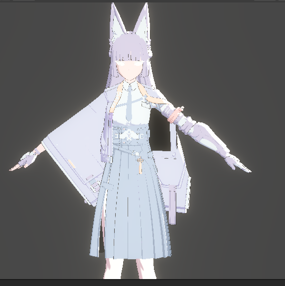

效果出来了！！接下来我们给模型追加投影效果

## 投影追加

当前处理了兰伯特的明暗关系，现在进行投影的处理，使用屏幕空间投影

开启深度缓冲，调整深度贴图渲染模式

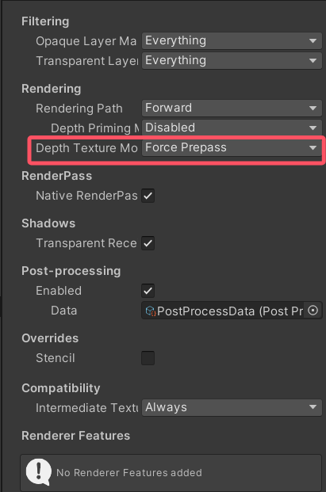

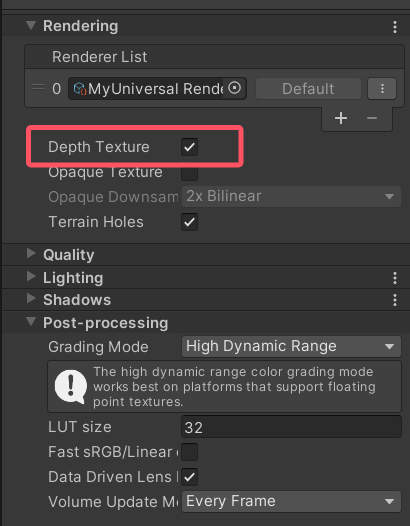

### 使用FrameDebug查看是否正常启用

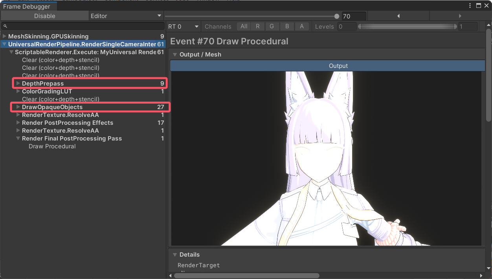

如果没有上面的两个过程说明深度缓冲没有开启这时候我们就该在追加一个Pass了

### 追加DepthOnlyPass

```plain
// DepthOnlyPass
Name"DepthOnly"
Tags
{
    "LightMode" = "DepthOnly"
}
ZWrite [_ZWrite]
ZTest LEqual
ColorMask 0
Cull [_Cull]
// HLSL程序段
HLSLPROGRAM

#pragma multi_compile_instancing
#pragma multi_compile _ DOTS_INSTANCING_ON

#pragma vertex vert
#pragma fragment frag


struct Attributes
{
    float4 positionOS : POSITION;

};
struct Varyings
{
    float4 positionCS : SV_POSITION;
};

Varyings vert(Attributes input)
{
    Varyings output = (Varyings)0;
    output.positionCS = TransformObjectToHClip(input.positionOS.xyz);
    return output;
}

float4 frag(Varyings input) : SV_TARGET
{
    clip(1.0 - _AlphaClip);

    return 0;
}
ENDHLSL
```

### 参数追加

```plain
[Header(Screen Space Shadow)]
[Toggle(_SCREEN_SPACE_SHADOW)] _ScreenSpaceShadow("Screen Space Shadow", int) = 1
_ScreenSpaceShadowWidth("Screen Space Shadow Width", Range(0, 1)) = 0.2
_ScreenSpaceShadowThreshold("Screen Space Shadow Threshold", Range(0, 1)) = 0.015
_ScreenSpaceShadowFadeout("Screen Space Shadow Fadeout", Range(0, 10)) = 0.2
```

### 投影追加

```plain
//投影追加
float shadowAttenuation = 1.0;
#if _SCREEN_SPACE_SHADOW
{
    //读取像素深度
    float linearEyeDepth = input.positionCS.w;
    //透视除法计算透视因子转换到NDC标准化空间
    float perspective = 1.0 / linearEyeDepth;
    //计算偏移方向乘量
    float offsetMul = _ScreenSpaceShadowWidth * 5.0 * perspective / 100.0;
    //将光向量转换到视图空间
    float3 lightDirectionVS = TransformWorldToViewDir(lightDirectionWS);
    //计算偏移值
    float2 offset = lightDirectionVS.xy * offsetMul;

    //屏幕采样
    int2 coord = input.positionCS.xy + offset * _ScaledScreenParams.xy;
    //钳制防止采样到边界
    coord = min(max(0, coord), _ScaledScreenParams.xy - 1);
    //读取深度图
    float offsetSceneDepth = LoadSceneDepth(coord);
    //深度图是经过透视变换过的所以是非线性，这里进行转线性_ZBufferParams里面有近裁面和远裁面信息
    float offsetSceneLinearEyeDepth = LinearEyeDepth(offsetSceneDepth, _ZBufferParams);

    //控制阴影衰减程度，进行钳制
    float fadeout = max(1e-5, _ScreenSpaceShadowFadeout);
    //偏移后的深度图减去原来的深度图
    shadowAttenuation = saturate((offsetSceneLinearEyeDepth - (linearEyeDepth - _ScreenSpaceShadowThreshold)) * 50 / fadeout);
    //shadowAttenuation = saturate((offsetSceneLinearEyeDepth-linearEyeDepth+0.015)*50);
}
#endif
```

#### 分段解析

对于深度信息，实际上就是裁剪空间下的w分量，如果要映射到屏幕上，还需要进行透视除法，也就是需要除以W分量 这里先取得了W分量，然后计算了透视除法的因子，也就是$ 1.0/linearEyeDepth $

```plain
//读取像素深度
float linearEyeDepth = input.positionCS.w;
//透视除法计算透视因子转换到NDC标准化空间
float perspective = 1.0 / linearEyeDepth;
```

然后接着计算偏移的乘量，_ScreenSpaceShadowWidth是我们自定义的参数，这里乘上5.0是经验值为了方便调整参数，然后乘上透视因子perspective，最后除以100应该是进行百分制的换算，就计算完成

```plain
//计算偏移方向乘量
float offsetMul = _ScreenSpaceShadowWidth * 5.0 * perspective / 100.0;
```

下面先对光向量进行处理，将光向量转换到视图空间，偏移值则是取X和Y分量，也就是仅在屏幕上上下或者左右偏移，最后乘上偏移的乘量，应该可以理解为灯光偏移百分之多少

```plain
//将光向量转换到视图空间
float3 lightDirectionVS = TransformWorldToViewDir(lightDirectionWS);
//计算偏移值
float2 offset = lightDirectionVS.xy * offsetMul;
```

计算屏幕UV采样坐标，原坐标就是裁剪空间的XY，Offset是NDC下的所以需要乘上屏幕的长宽，然后对坐标进行限制防止越界。然后就是采样，采样出来的是非线性的所以需要进行转换，最后就是进行线性转换

```plain
//屏幕采样
int2 coord = input.positionCS.xy + offset * _ScaledScreenParams.xy;
//钳制防止采样到边界
coord = min(max(0, coord), _ScaledScreenParams.xy - 1);
//读取深度图
float offsetSceneDepth = LoadSceneDepth(coord);
//深度图是经过透视变换过的所以是非线性，这里进行转线性_ZBufferParams里面有近裁面和远裁面信息
float offsetSceneLinearEyeDepth = LinearEyeDepth(offsetSceneDepth, _ZBufferParams);
```

为了有效地利用深度缓冲区的有限精度，深度值通常会经过非线性映射。例如，常用的深度映射公式是：$ zndc = zclip/zclip + d $其中zclip是裁剪平面的位置 ,d是物体到摄像机的距离。这个公式导致了深度值在近处变化更快，而在远处变化较慢。 这里进行最终投影计算，使用偏移过后的深度图减去原深度图，这里为了防止在距离非常近的情况下两个图相减效果不对所以需要对原深度图减去一个阈值这样可以保证两个图之间一定会有差值并且不会出现自阴影，最后进行x50这个经验值进行增强对比度在除以一个人为控制的衰减值，这里是除数所以必须大于0 !

```plain
//控制阴影衰减程度，进行钳制
float fadeout = max(1e-5, _ScreenSpaceShadowFadeout);
//偏移后的深度图减去原来的深度图
shadowAttenuation = saturate((offsetSceneLinearEyeDepth - (linearEyeDepth - _ScreenSpaceShadowThreshold)) * 50 / fadeout);
//shadowAttenuation = saturate((offsetSceneLinearEyeDepth-linearEyeDepth+0.015)*50);
```

## 投影效果

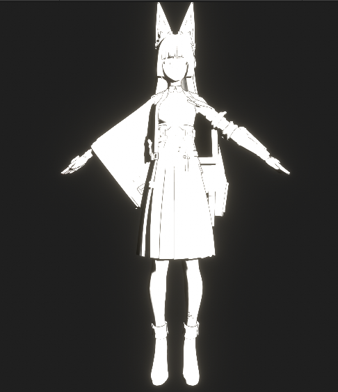

## 将投影追加到光照层级中

这里保证了能量守恒，将投影全部给了ShallowFade，Shadow部分保持不变。Shallowfade能量增加，Shallow能量减小了，这里计算特别复杂，需要画图分析，看看代码就行

```plain
//投影追加修改（*）
float sRamp[2] = {
    2.0 * shadowAttenuation,        // 范围[0, 2]   投影1
    2.0 * shadowAttenuation - 1     // 范围[-1, 1]  投影2 shadowAttenuationd大于0.5时才影响
};


albedoShallowFade *= saturate(sRamp[0]);
albedoShallowFade += (1 - albedoShadowFade - albedoShadow) * saturate(1 - sRamp[0]);
//albedoShallowFade =saturate(albedoShallowFade); 

albedoShallow *= saturate(min(sRamp[0], 1 - sRamp[1])) + saturate(sRamp[1]);     
albedoSSS *= saturate(min(sRamp[0], 1 - sRamp[1])) + saturate(sRamp[1]);
albedoSSS += (albedoFront + albedoForward) * saturate(min(sRamp[0], 1 - sRamp[1]));
albedoFront *= saturate(sRamp[1]);
albedoForward *= saturate(sRamp[1]);
```

## 面部阴影SDF重构

### 添加空组件进行定位

找到模型骨骼的头部，添加三个空组件用于定位  
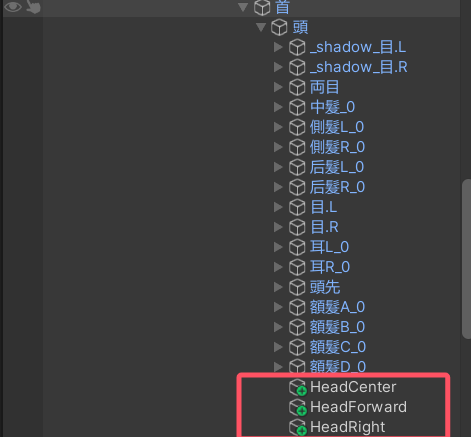

### 创建C#脚本

开启编辑模式也可以调用

下面是完整的脚本代码

```csharp
using System.Collections;
using System.Collections.Generic;
using UnityEngine;

[ExecuteInEditMode]
public class NewBehaviourScript : MonoBehaviour
{
    public Transform HeadBoneTransform;
    public Transform HeadForwardTransform;
    public Transform HeadRightTransform;

    private Renderer[] allRanderers;

    private int headCenterID = Shader.PropertyToID("_HeadCenter");
    private int headForwardID = Shader.PropertyToID("_HeadForward");
    private int headRightID = Shader.PropertyToID("_HeadRight");
    //脚本开启时也更新一次
    #if UNITY_EDITOR
    void OnValidate() 
    {
        Update();    
    }
    #endif

    // Update is called once per frame
    void Update()
    {
        if(allRanderers == null)
        {
            allRanderers = GetComponentsInChildren<Renderer>(true);
        }
        for(int i = 0; i < allRanderers.Length; i++) 
        {
            Renderer r = allRanderers[i];
            foreach (Material mat in r.sharedMaterials)
            {
                if (mat.shader)
                {
                    if (mat.shader.name == "URP/Miyabi")
                    {
                        mat.SetVector(headCenterID, HeadBoneTransform.position);
                        mat.SetVector(headForwardID, HeadForwardTransform.position);
                        mat.SetVector(headRightID, HeadRightTransform.position);

                    }  
                }
            }
        }
    }
}
```

### 追加参数

```plain
[Header(SDF)]
[NoScaleOffset] _SDFTex("SDFTexture",2D) = "White"{}
_HeadCenter("HeadCenter", Vector) = (0,0,0,0)
_HeadForward("HeadForward", Vector) = (0,0,0,0)
_HeadRight("HeadRight", Vector) = (0,0,0,0)
```

### 采样SDF图

通过脚本传入值计算角度阈值等，点乘判断光线方向进行UV的水平方向翻转 计算阈值是为了混合光照强度，当正脸有光照的话就将混合强度降低，而背光时就需要将面部增亮了

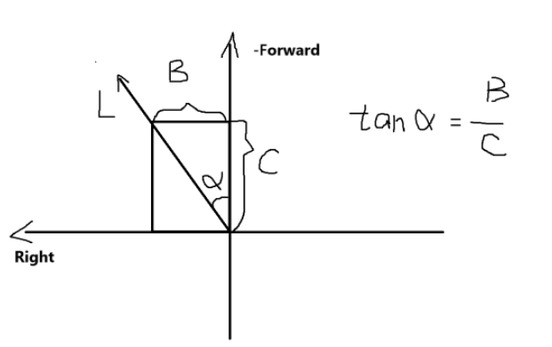

注意这里不是常规的反正切而是actan2函数，对应上图的话就是左右分两半，从-Forward方向为起点也就是0，向下为末端π，左半为正右半为负。所以函数的输出范围就是-π到π，那么转为弧度就-1到1。如果大于0就1-去这个值，小于零就加1，这样就得到当光线在正面时为0，在背面为1

```plain
#if _DOMAIN_FACE
{
    float3 headForward = normalize(_HeadForward - _HeadCenter);
    float3 headRight = normalize(_HeadRight - _HeadCenter);
    float3 headUp = normalize(cross(headForward, headRight));

    float3 lightDirectionProjHeadWS = lightDirectionWS - dot(lightDirectionWS,headUp) * headUp;
    lightDirectionProjHeadWS = normalize(lightDirectionProjHeadWS);

    float sX = dot(lightDirectionProjHeadWS, headRight);
    float sZ = dot(lightDirectionProjHeadWS, -headForward);

    angleThreshold = atan2(sX, sZ) / 3.14159265359; //角度转弧度
    angleThreshold = angleThreshold > 0 ? (1 - angleThreshold) : ( 1 + angleThreshold);

    float2 angleUV = input.uv;
    //判断光线是否在右侧，如果在右侧需要翻转UV的水平方向
    if(dot(lightDirectionProjHeadWS, headRight) > 0)
    {
        angleUV.x = 1.0 - angleUV.x;
    }

    float4 angleData =  SAMPLE_TEXTURE2D(_SDFTex, sampler_SDFTex, angleUV);

    angleMapping = angleData.r;
    angleFunction = angleData.g;
    angleMapMask = angleData.a;
}
#endif
```

### 将SDF融入光照模型

```plain
//SDF
#if _DOMAIN_FACE
{
    float s = lerp(_AlbedoSmoothness, 0.025, saturate(2.5 * (angleFunction - 0.5)));
    s = max(1e-5, s);

    float angleAttenuation = 0.6 + (angleMapping * 1.2 - 0.6) / (s * 4 + 1) - angleThreshold;

    float aRamp[3] = 
    {
        angleAttenuation / s,
        angleAttenuation / s - 1,
        angleAttenuation / 0.125 - 16 * s
    };

    float angleShadowFade = saturate(1 - aRamp[0]);
    float angleShadow = 0;
    float angleShallowFade = 0;
    float angleShallow = 0;
    float angleSSS = min(saturate(1 - aRamp[1]), saturate(aRamp[0]));
    float angleFront = min(saturate(1 - aRamp[2]), saturate(aRamp[1]));
    float angleForward = saturate(aRamp[2]);
    
    float sRamp[1] = {
        2 * shadowAttenuation
    };

    angleShadowFade *= saturate(1 - sRamp[0]);
    angleShallowFade += (1 - angleForward - angleFront - angleSSS - angleShallow) * saturate(sRamp[0]);
    angleShallowFade += (angleSSS + angleFront + angleForward) * saturate(1 - sRamp[0]);
    angleSSS *= saturate(sRamp[0]);
    angleFront *= saturate(sRamp[0]);
    angleForward *= saturate(sRamp[0]);


    albedoShadowFade = lerp(albedoShadowFade, angleShadowFade, angleMapMask);
    albedoShadow = lerp(albedoShadow, angleShadow, angleMapMask);
    albedoShallowFade = lerp(albedoShallowFade, angleShallowFade, angleMapMask);
    albedoShallow = lerp(albedoShallow, angleShallow, angleMapMask);
    albedoSSS = lerp(albedoSSS, angleSSS, angleMapMask);
    albedoFront = lerp(albedoFront, angleFront, angleMapMask);
    albedoForward = lerp(albedoForward, angleForward, angleMapMask);
}
#endif
```

### 效果展示

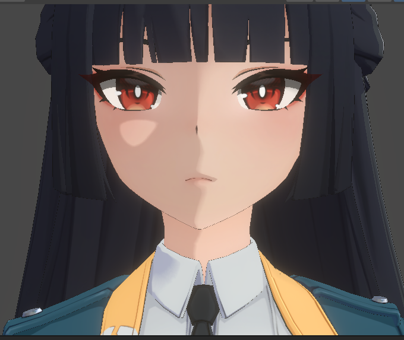

## 书接上回接着往下看吧

## 鼻线添加

转动灯光到正面这里看不见鼻子了，所以需要对鼻线进行添加

### 贴图信息

鼻线的位置在面部贴图的Alpha通道中

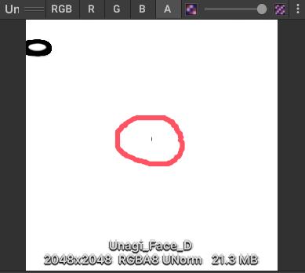

之前代码中已经提取了，但没有使用

```plain
#if _DOMAIN_BODY || _DOMAIN_EYE
{
    baseAlpha = var_MainTex.a;
}
#endif
```

### 获取观察向量

因为鼻线需要对视线方向做混合，偏转大的视角比如说侧脸，就直接看不见鼻线，所以需要获取观察向量

```plain
float3 viewDirWS = normalize(input.viewDirWS);
```

### 计算鼻线的DisplayValue

这里直接在SDF代码下面写就行。先获取描边颜色，后面进行混合处理。根据点乘判断方向>0同向，小于0反向，计算ViewDir和HeadUP点积已及ViewDir和HeadRight点积。

我这里偷懒没有对鼻线的颜色进行修改，直接就使用面部描边颜色_OutLineColor1了，如果要修改再加一个变量控制即可

```plain
float3 outlineColor = _OutLineColor1,rgb * 0.2;
float viewDotHeadUp = dot(viewDirWS, headUp);
float viewDotHeadRight = dot(headForward, viewDirWS);
```

计算混合值，这里很多应该都是经验性的处理，对_NoseLineKDnDisp,_NoseLineHoriDisp进行插值，这里是进行了竖直方向的Alpha控制，混合水平控制直接使用了viewDotHeadForward - dispValue;然后钳制和混和贴图鼻线

```plain
 //视角从上往下到水平之间Alpha由水平值控制，从下往上则由_NoseLineKDnDispk控制
float dispValue = lerp(_NoseLineKDnDisp, _NoseLineHoriDisp, smoothstep(0, 0.75, saturate(viewDotHeadUp + 0.85)));
dispValue = viewDotHeadForward - dispValue;
dispValue = smoothstep(0, 0.02, dispValue); 
dispValue -= var_MainTex.a;
baseCol = lerp(baseCol, outlineColor, saturate(dispValue));
```

反正最后效果就是上下左右的偏转都看不见鼻线，只在正脸的小范围有鼻线。理论上乘法混合，效果也差不多，但因为乘法原因是取到0时对应角度太大了，所以得对viewDotHeadForward范围钳制一次，有点多余。这块自己随意调整吧

### 鼻线效果

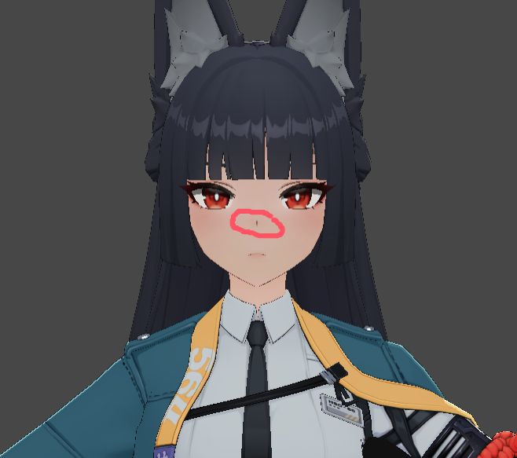

接下来就到大家喜欢的丝袜制作环节了

## 添加MatCap

### 贴图

B通道是MatCap的Mask

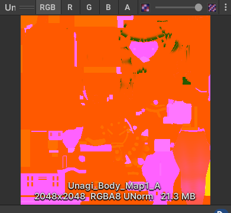

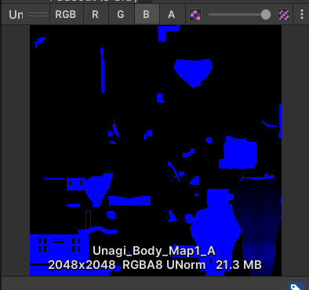

这里有3张MatCap,分别对应是高光，金属，丝袜

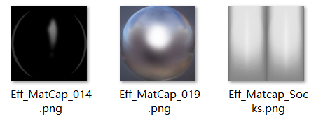

先把贴图上上


### 读取MatCapMask

#### 初始化

```plain
//MatCap
float matCapMask = 0;
```

#### 采样

```plain
//MatCap
float4 var_OtherDataTex2 = SAMPLE_TEXTURE2D(_OtherDataTex2, sampler_OtherDataTex2, input.uv); 
matCapMask = var_OtherDataTex2.b;
```

我们来看一下matcapmask区域

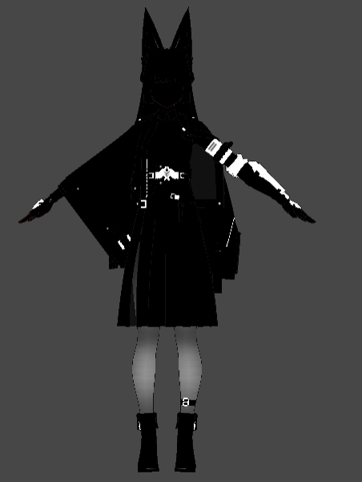

可以明显看到在丝袜，金属部分有matcap遮罩不错！

### 添加参数

#### MatCap宏开关和贴图

```plain
[Header(MatCap)]
[Toggle(_MATCAP_ON)] _MatCap_On("MatCap_On", int) = 0
[NoScaleOffset] _MatCapTex1("_MatCapTex1", 2D) = "White"{}
[NoScaleOffset] _MatCapTex2("_MatCapTex2", 2D) = "White"{}
[NoScaleOffset] _MatCapTex3("_MatCapTex3", 2D) = "White"{}
[NoScaleOffset] _MatCapTex4("_MatCapTex4", 2D) = "White"{}
[NoScaleOffset] _MatCapTex5("_MatCapTex5", 2D) = "White"{}
```

#### MatCap的基础混色，混合颜色强度强度，混合Alpha程度

```plain
_MatCapTintColor1("_MatCapTintColor1",  Color) = (1, 1, 1, 1)
_MatCapTintColor2("_MatCapTintColor2",  Color) = (1, 1, 1, 1)
_MatCapTintColor3("_MatCapTintColor3",  Color) = (1, 1, 1, 1)
_MatCapTintColor4("_MatCapTintColor4",  Color) = (1, 1, 1, 1)
_MatCapTintColor5("_MatCapTintColor5",  Color) = (1, 1, 1, 1)

_MatCapColorBurst1("MatCapColorBurst1", Range(0, 10)) = 1
_MatCapColorBurst2("MatCapColorBurst2", Range(0, 10)) = 1
_MatCapColorBurst3("MatCapColorBurst3", Range(0, 10)) = 1
_MatCapColorBurst4("MatCapColorBurst4", Range(0, 10)) = 1
_MatCapColorBurst5("MatCapColorBurst5", Range(0, 10)) = 1

_MatCapAlphaBurst1("MatCapAlphaBurst1", Range(0, 10)) = 1
_MatCapAlphaBurst2("MatCapAlphaBurst2", Range(0, 10)) = 1
_MatCapAlphaBurst3("MatCapAlphaBurst3", Range(0, 10)) = 1
_MatCapAlphaBurst4("MatCapAlphaBurst4", Range(0, 10)) = 1
_MatCapAlphaBurst5("MatCapAlphaBurst5", Range(0, 10)) = 1
```

#### 反射开关

这里没有设置宏，仅为开关，在后面声明之后当Float（Bool）用就行。还有深度值，用于计算折射!

```plain
[Toggle] _MatCapRefract1("MatCapRefract1", int) = 0
[Toggle] _MatCapRefract2("MatCapRefract2", int) = 0
[Toggle] _MatCapRefract3("MatCapRefract3", int) = 0
[Toggle] _MatCapRefract4("MatCapRefract4", int) = 0
[Toggle] _MatCapRefract5("MatCapRefract5", int) = 0

_MatCapDepth1("MatCapDepth1", Float) = 0.5
_MatCapDepth2("MatCapDepth2", Float) = 0.5
_MatCapDepth3("MatCapDepth3", Float) = 0.5
_MatCapDepth4("MatCapDepth4", Float) = 0.5
_MatCapDepth5("MatCapDepth5", Float) = 0.5
```

#### 混合模式设置，UV偏移

```plain
[Enum(AlphaBlend, 0, Add, 1, Overlay, 2)] _MatCapBlendMode1("MatCapBlendMode1", int) = 0
[Enum(AlphaBlend, 0, Add, 1, Overlay, 2)] _MatCapBlendMode2("MatCapBlendMode2", int) = 0
[Enum(AlphaBlend, 0, Add, 1, Overlay, 2)] _MatCapBlendMode3("MatCapBlendMode3", int) = 0
[Enum(AlphaBlend, 0, Add, 1, Overlay, 2)] _MatCapBlendMode4("MatCapBlendMode4", int) = 0
[Enum(AlphaBlend, 0, Add, 1, Overlay, 2)] _MatCapBlendMode5("MatCapBlendMode5", int) = 0

_MatCapParam1("_MatCapWrapOffset1", Vector) = (5,5,0,0)
_MatCapParam2("_MatCapWrapOffset2", Vector) = (5,5,0,0)
_MatCapParam3("_MatCapWrapOffset3", Vector) = (5,5,0,0)
_MatCapParam4("_MatCapWrapOffset4", Vector) = (5,5,0,0)
_MatCapParam5("_MatCapWrapOffset5", Vector) = (5,5,0,0)
```

### 声明参数

```plain
//MatCap
float3 _MatCapTintColor1;
float3 _MatCapTintColor2;
float3 _MatCapTintColor3;
float3 _MatCapTintColor4;
float3 _MatCapTintColor5;

float _MatCapColorBurst1;
float _MatCapColorBurst2;
float _MatCapColorBurst3;
float _MatCapColorBurst4;
float _MatCapColorBurst5;

float _MatCapAlphaBurst1;
float _MatCapAlphaBurst2;
float _MatCapAlphaBurst3;
float _MatCapAlphaBurst4;
float _MatCapAlphaBurst5;

float _MatCapDepth1;
float _MatCapDepth2;
float _MatCapDepth3;
float _MatCapDepth4;
float _MatCapDepth5;

float4 _MatCapParam1;
float4 _MatCapParam2;
float4 _MatCapParam3;
float4 _MatCapParam4;
float4 _MatCapParam5;

int _MatCapRefract1;
int _MatCapRefract2;
int _MatCapRefract3;
int _MatCapRefract4;
int _MatCapRefract5;

int _MatCapBlendMode1;
int _MatCapBlendMode2;
int _MatCapBlendMode3;
int _MatCapBlendMode4;
int _MatCapBlendMode5;
```

### 计算MatCap

#### 获取MatCapMask

采样获得MatCapMask，在贴图的B通道中

```plain
//MatCap
float4 var_OtherDataTex2 = SAMPLE_TEXTURE2D(_OtherDataTex2, sampler_OtherDataTex2, input.uv); 
matCapMask = var_OtherDataTex2.b;
```

#### 计算UV

采样matCap的固定公式，将法线转换到观察空间，取XY作为UV进行采样，这里因为原本法线是-1<sub>1，这里需要重映射到0</sub>1

```plain
float3 matCapColor = baseCol;
#if _MATCAP_ON && _DOMAIN_BODY
{
    float mask = matCapMask;
    float3 normalVS = TransformWorldToViewDir(pixelNormalWS);
    //-1~1 映射到 0~1
    float2 matCapUV = normalVS.xy * 0.5 + 0.5;
}
#endif
```

#### 折射判断

对需要折射的部分进行判断，这里其实是直接根据折射开关的值来的，因为只有0和1的bool值

```plain
//折射
float refract = select(materialId,
    _MatCapRefract1,
    _MatCapRefract2,
    _MatCapRefract3,
    _MatCapRefract4,
    _MatCapRefract5
);
```

#### 折射系数及UV调整

这里并非是真的计算折射，其实只是对MatCap采样进行缩放和平移调整。 获取各个区域不同的UV和Depth参数进行混合，调整matCapUV param.xy * input.uv是表示物体UV方向的偏移(为了保证效果贴合物体本身UV)，但为了整体控制偏移也使用了$ + param.zw $

```plain
if(refract > 0.5)
{
    float4 param = select(materialId,
        _MatCapParam1,
        _MatCapParam2,
        _MatCapParam3,
        _MatCapParam4,
        _MatCapParam5
    );
    float depth = select(materialId,
        _MatCapDepth1,
        _MatCapDepth2,
        _MatCapDepth3,
        _MatCapDepth4,
        _MatCapDepth5
    );
    matCapUV = matCapUV * depth + param.xy * input.uv + param.zw;
}
```

#### 采样MatCap和混合参数

```plain
matCapColor = select(materialId,
    SAMPLE_TEXTURE2D(_MatCapTex1, sampler_MatCapTex1, matCapUV).rgb,
    SAMPLE_TEXTURE2D(_MatCapTex2, sampler_MatCapTex2, matCapUV).rgb,
    SAMPLE_TEXTURE2D(_MatCapTex3, sampler_MatCapTex3, matCapUV).rgb,
    SAMPLE_TEXTURE2D(_MatCapTex4, sampler_MatCapTex4, matCapUV).rgb,
    SAMPLE_TEXTURE2D(_MatCapTex5, sampler_MatCapTex5, matCapUV).rgb
);

float3 tintColor = select(materialId,
    _MatCapTintColor1,
    _MatCapTintColor2,
    _MatCapTintColor3,
    _MatCapTintColor4,
    _MatCapTintColor5
);

float alphaBurst = select(materialId,
    _MatCapAlphaBurst1,
    _MatCapAlphaBurst2,
    _MatCapAlphaBurst3,
    _MatCapAlphaBurst4,
    _MatCapAlphaBurst5 
);
float colorBurst = select(materialId,
    _MatCapColorBurst1,
    _MatCapColorBurst2,
    _MatCapColorBurst3,
    _MatCapColorBurst4,
    _MatCapColorBurst5 
);

int blendMode = select(materialId,
    _MatCapBlendMode1,
    _MatCapBlendMode2,
    _MatCapBlendMode3,
    _MatCapBlendMode4,
    _MatCapBlendMode5
);
```

#### 混合模式

这里是三种混合方式

```plain
//乘法Alpha混合
if(blendMode == 0)
{
    float alpha = saturate(alphaBurst * mask);
    float3 blendColor = tintColor * matCapColor * colorBurst;
    matCapColor = lerp(baseCol, blendColor, alpha);
}
//加法混合
else if(blendMode == 1)
{
    float alpha = saturate(alphaBurst * mask);
    float3 blendColor = tintColor * matCapColor * colorBurst;
    matCapColor = baseCol + blendColor * alpha;
}
//叠加混合
else if(blendMode == 2)
{
    float alpha = saturate(alphaBurst * mask);
    float3 blendColor = saturate((matCapColor * tintColor - 0.5) * colorBurst + matCapColor *  tintColor);
    blendColor = lerp(0.5, blendColor, alpha);
    matCapColor = lerp(blendColor * baseCol * 2, 1 - 2 * (1 - baseCol) * (1 - blendColor), baseCol >= 0.5);
}
```

#### 分段解释

##### 乘法混合（Multiply Alpha Blend）

这里先计算Alpha的值，blendColor就是MatCap采样颜色乘上基础混合颜色和Matcap颜色总强度，最后是使用alpha进行插值

从效果来说，乘法会使颜色变暗，而使用alpha混合，输出部分就全部是Matcap颜色或全是基础颜色，两者是不会有重叠的

##### 加法混合（Additive Blend）

同样先计算Alpha，几个混合模式中Alpha是一样的。这里是先是使用乘法混合matcap颜色和相关系数，最后是加法混合，使用原本颜色加上matcap颜色

效果来说就，在最后一步加法混合时，原颜色并没有剔除掉Alpha中部分，所以在alpha区域两个颜色相加就会变亮

##### 叠加混合（Overlay Blend）

###### 公式一：对比度调整

$$ adjustedColor = (originalColor - 0.5) * contrast + 0.5 $$

###### 公式二：叠加混合

$$
C_{out} = \left\{
\begin{matrix}
2 \cdot C_{base} \cdot C_{blend} & \text{if } C_{base} < 0.5 \\
1 - 2 \cdot (1 - C_{base}) \cdot (1 - C_{blend}) & \text{if } C_{base} \geq 0.5
\end{matrix}
\right.
$$

先对matcap的blendColor进行处理，-0.5就是原本颜色范围变成-0.5~0.5以0.5为中心环绕，这时这个值作为一个基数在乘上颜色强度就得到了一个降低暗部增强亮部的系数，最后加上原本的matcapColor,相当于以matcapColor增强对比度

为了防止前面的颜色对比度过高失真所以使用一个中性灰色0.5进行平滑

以0.5为边界用来区分高亮区域和阴影区域，高于0.5就增强，低于0.5就削弱，效果来可以理解为增加对比度

### matcap参数调整

#### 饰品手臂部分

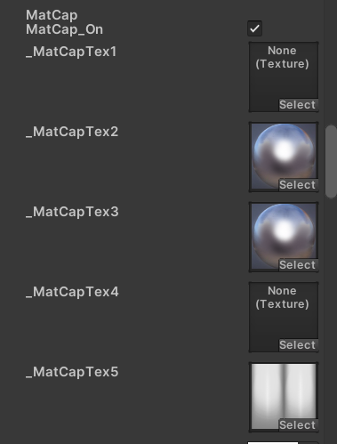

第2个槽位是金属手臂的材质  
第3个槽位是饰品的材质  
第5个槽位是丝袜的材质，所以进行染色和开启反射，这里取消他的偏移，使它不按照物体UV进行偏移反射！

说了你们看不出来直接看图吧！

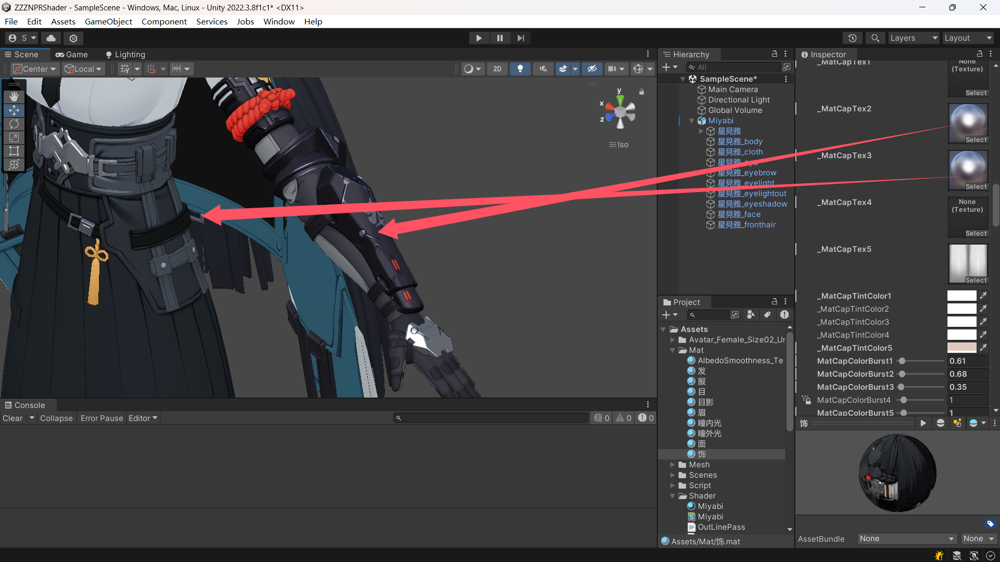


#### 衣服身体部分

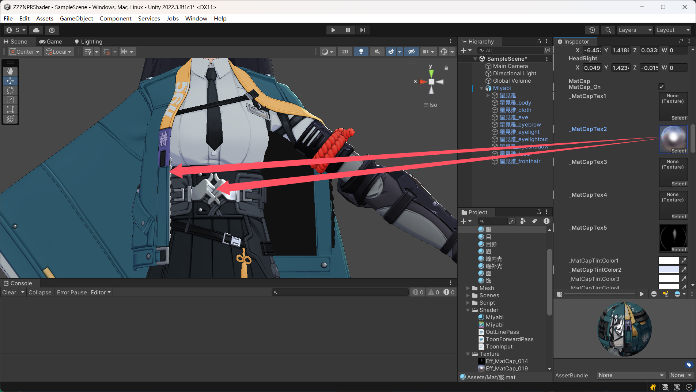

什么？你问第5个槽的Matcap不生效是什么原因，请看上面的matcapmask输出，第5个槽原本是对应的裙摆，可以看到裙摆上并没有mask。

### matcap效果（你们最期待的丝袜来了）

#### 饰品和手臂部分

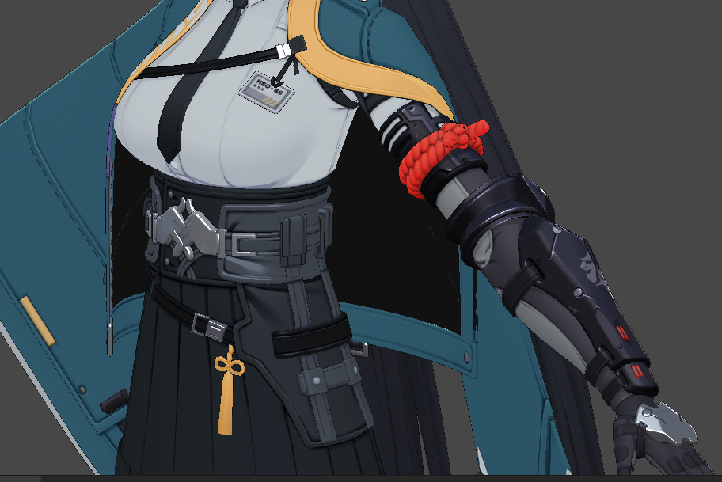

#### 衣服部分

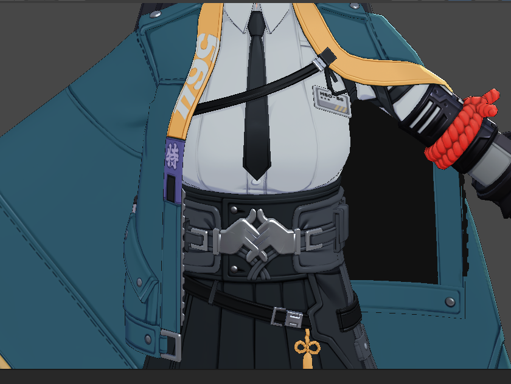

#### 丝袜部分


## 颜色锐化处理

### 获取遮蔽信息

```plain
//颜色调整
float3 gammaColor = matCapColor;
{
    float pixelNDotL = dot(pixelNormalWS, lightDirectionWS);
    float NDotL = dot(normalWS, lightDirectionWS); 
}
```

pixelNDotL，含贴图法线发兰伯特拥有很多细节  
NDotL，顶点法线的兰伯特非常光滑细节较少  
NDotL - pixelNDotL，两者相减可以得到物体的凹凸信息，那么用1减去这个值就可以得到一个遮罩的遮蔽信息occlusion

### 遮蔽信息调整

```plain
float occlusion = saturate(1 - 3 * (NDotL - pixelNDotL)) * 2;
occlusion *= sqrt(occlusion);
occlusion = min(1, occlusion);
```

### 颜色Gamma矫正衰减系数

最后计算获得一个颜色衰减值，兰伯特的值是-1<sub>1，这里使用半兰伯特0</sub>1和遮罩系数进行计算是为了保留教暗地方的依旧有颜色衰减值，我们默认使用的是兰伯特光照，所以这里进行混合，使用0.5也就是均匀混合。这样就得到了一个颜色的衰减值，注意这里说的衰减值是作用于Gamma矫正也就是颜色变化，而不是仅仅亮度变化，这里叫做颜色Gamma矫正衰减系数应该比较合适

```plain
//颜色Gamma矫正衰减系数
float attenuation = lerp((pixelNDotL * 0.5 + 0.5) * occlusion, saturate(pixelNDotL), 0.5);
```

### Gamma矫正

#### 颜色钳制

有了颜色Gamma矫正衰减系数，然后知道Gamma矫正的值后，就可以对颜色进行Gamma矫正了，但在这之前需要钳制颜色亮度，因为Gamma其实本质可以理解为Pow(Color，gamma)，对于大于1的进行Pow会导致变得非常亮

```plain
//钳制亮度
float3 matCapColorClamped = ClampColorMax(matCapColor);
```

这里函数内部对颜色各个分量取得最大值，如果大于1，就将整个颜色除以这个值进行压暗，保证颜色不变的情况下降低明度，钳制到1以下

```plain
//颜色钳制处理
float3 ClampColorMax(float3 color)
{
    float maxComponent = max3(color.r, color.g, color.b);
    if(maxComponent > 1.0)
    {
        return color / maxComponent;
    }
    return color;
}
```

#### 计算颜色亮度和gamma值

这里Luminance()函数是根据权重计算颜色的灰度（亮度）值。最终通过灰度值来控制Gmma值基数，使用颜色Gamma矫正衰减系数混合，这里这个乘 0.2875和加1.4375的操作也属于经验值，并不是固定的，以效果为准

```plain
//颜色转单一亮度
float luminance = Luminance(matCapColor);
//计算gamma值
float gamma = lerp(luminance * 0.2875 + 1.4375, 1, attenuation);
```

现在有了Gama值后，现在就进行颜色的Gamma矫正了。直接使用pow即可，钳制一下不要等于0了，根据效果来调整强度，使用兰伯特控制，亮的部分就使用Gamma，暗的地方就减小Gamma强使用GammaHalf

```plain
//颜色进行Gamma
float3 matCapColorGamma = pow(max(1e-5, matCapColorClamped), gamma); 
//Gamma效果削弱
float3 matCapColorGammaHalf = lerp(matCapColor, matCapColorGamma, 0.5);
//均衡Gamma效果
gammaColor = lerp(matCapColorGammaHalf, matCapColorGamma, saturate(NDotL));
```

## 添加PBR高光

### 追加高光参数

```plain
[Header(Specular)]
//Metallic
_Metallic("Metallic", Range(0, 10)) = 0
_Glossiness("Glossiness", Range(0, 1)) = 0
[Toggle] _HighlightShape1("HighlightShape1", int) = 0
[Toggle] _HighlightShape2("HighlightShape2", int) = 0
[Toggle] _HighlightShape3("HighlightShape3", int) = 0
[Toggle] _HighlightShape4("HighlightShape4", int) = 0
[Toggle] _HighlightShape5("HighlightShape5", int) = 0

_HeadSphereRang("HeadSphereRang", Range(0, 1)) = 0

_ShapeSoftness1("ShapeSoftness1", Range(0, 1)) = 1
_ShapeSoftness2("ShapeSoftness2", Range(0, 1)) = 1
_ShapeSoftness3("ShapeSoftness3", Range(0, 1)) = 1
_ShapeSoftness4("ShapeSoftness4", Range(0, 1)) = 1
_ShapeSoftness5("ShapeSoftness5", Range(0, 1)) = 1

_SpecularRnge1("SpecularRnge1", Range(0, 2)) = 1
_SpecularRnge2("SpecularRnge2", Range(0, 2)) = 1
_SpecularRnge3("SpecularRnge3", Range(0, 2)) = 1
_SpecularRnge4("SpecularRnge4", Range(0, 2)) = 1
_SpecularRnge5("SpecularRnge5", Range(0, 2)) = 1


_ToonSpecular1("ToonSpecular1", Range(0, 1)) = 0.01
_ToonSpecular2("ToonSpecular2", Range(0, 1)) = 0.01
_ToonSpecular3("ToonSpecular3", Range(0, 1)) = 0.01
_ToonSpecular4("ToonSpecular4", Range(0, 1)) = 0.01
_ToonSpecular5("ToonSpecular5", Range(0, 1)) = 0.01

_ModelSize1("ModelSize1", Range(0, 100)) = 1
_ModelSize2("ModelSize2", Range(0, 100)) = 1
_ModelSize3("ModelSize3", Range(0, 100)) = 1
_ModelSize4("ModelSize4", Range(0, 100)) = 1
_ModelSize5("ModelSize5", Range(0, 100)) = 1


_SpecularIntensity("SpecularIntensity", Range(0, 1)) = 0.1

[HDR]_SpecularColor1("SpecularColor1",  Color) = (1, 1, 1, 1)
[HDR]_SpecularColor2("SpecularColor2",  Color) = (1, 1, 1, 1)
[HDR]_SpecularColor3("SpecularColor3",  Color) = (1, 1, 1, 1)
[HDR]_SpecularColor4("SpecularColor4",  Color) = (1, 1, 1, 1)
[HDR]_SpecularColor5("SpecularColor5",  Color) = (1, 1, 1, 1)

```

### 高光贴图信息

#### 金属Mask和高光遮罩在下方贴图中

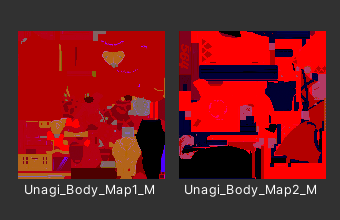

#### 金属图，G通道

注意这里的金属度图并非是非0和1，大概是64/255这个样子，应该是想表达带漆面的金属效果一类

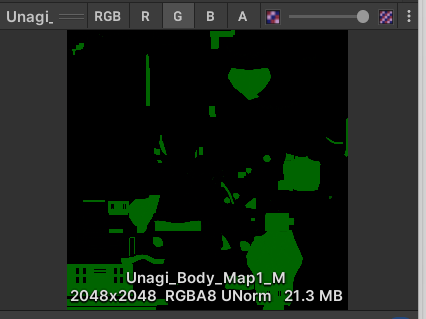

#### 高光Mask，B通道

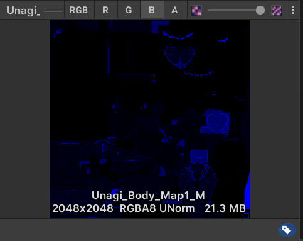

#### 光滑度信息在下方的贴图的G通道中

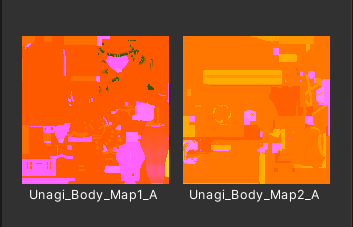

#### Smoothnesss，G通道

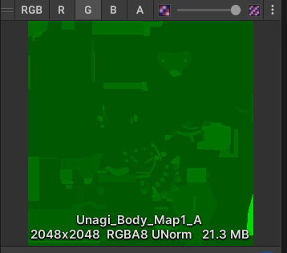

### PBR金属高光和漫反射划分

获取对应的金属信息和高光遮罩

```plain
//Metallic
metallic = _Metallic * var_OtherDataTex1.g;
specularMask = var_OtherDataTex1.b;

smoothness = _Glossiness * var_OtherDataTex2.g;
```

pbrDiffuseColor进行金属与非金属的划分，非金属的最大漫反射比例是0.96，0.96 x GammColor就是非金属的漫反射，而金属部分是只有镜面反射的没有漫反射，所以漫反射为0。pbrSpecularColor镜面反射，非金属的镜面反射比例就是1-0.96，因为非金属的镜面反射颜色不受本身颜色影响仅受材料的反射率影响，所以这里给上0.04固定颜色。而金属部分，金属的镜面反射是受颜色影响的所以反射原本的颜色

### 金属部分颜色

```plain
// 非金属有0.04去了高光反射，所以漫反射乘上0.96
float3 pbrDiffuseColor = lerp(0.96 * gammaColor, 0, metallic);
float3 pbrSpecularColor = lerp(0.04, gammaColor, metallic);
```

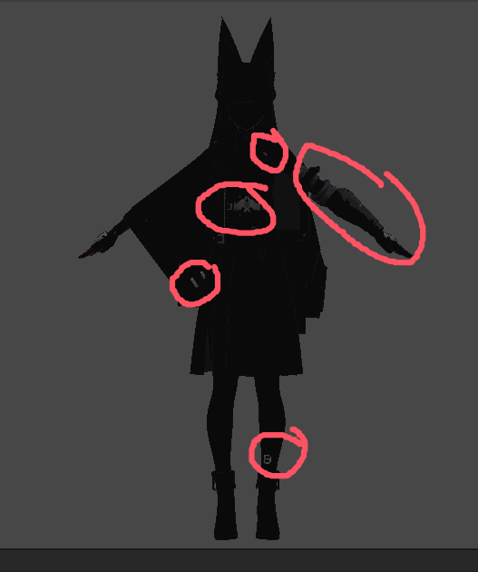

### 球状法线

```plain
if(shape > 0.5)
{
    //判断使用球形法线的时候，_HeadSphereRang是否生效
    bool useSphere = _HeadSphereRang > 0;
    //球形法线计算
    float3 sphereNormalWS = positionWS - _HeadCenter;
    //法线长度
    float len = length(sphereNormalWS);
    sphereNormalWS = normalize(sphereNormalWS);
}
```

由于这样粗略计算会导致身上的一些部位也变成使用球形法线，所以得限制一下范围,超出范围的部分用回贴图法线

```plain
float sphereUsage = 1.0 - saturate((len - _HeadSphereRange) * 20);
float3 shapeNormalWS = lerp(pixelNormalWS, sphereNormalWS, sphereUsage)
return float4(sphereNormalWS, 1);
```

只要脑袋上的头发部分是球形法线就行

### Blinn-Phong高光

```plain
//高光项，法线决定高光形状
float shapeNoL = dot(lightDirectionWS, sphereNormalWS);
float shapeAttenuation = sqrt(saturate(shapeNoL * 0.5 + 0.5));

float NDotH = dot(sphereNormalWS, halfWS);
float NDotH01 = saturate(NDotH * 0.5 + 0.5);
```

获得过度，用高光除上过度，接着乘上几何项和菲涅尔项

```plain
float headSpecular = NDotH01 * shapeAttenuation + specularMask - 1; 

float softness = select(materialId,
    _ShapeSoftness1,
    _ShapeSoftness2,
    _ShapeSoftness3,
    _ShapeSoftness4,
    _ShapeSoftness5
);

//软硬控制
headSpecular = saturate(headSpecular / softness);
headSpecular = headSpecular * min(1.0, 1.0 / (6.0 * rangeLoH2)) * rangeNoL;
```

### 几何项和菲涅尔项的计算

```plain
float shape = select(materialId,
        _HighlightShape1,
        _HighlightShape2,
        _HighlightShape3,
        _HighlightShape4,
        _HighlightShape5

    );
    
    float range = select(materialId,
        _SpecularRnge1,
        _SpecularRnge2,
        _SpecularRnge3,
        _SpecularRnge4,
        _SpecularRnge5
    );

    //半角向量
    float3 halfWS = normalize(lightDirectionWS + viewDirWS);

    //计算高光项
    float LoH = dot(lightDirectionWS, halfWS); //0~1
    float rangeLoH = saturate(range * LoH * 0.75 + 0.25);//保证最低亮度为0.25但最大亮度还是为1
```

### Smoothness控制

这一种高光采用GGX（微表面分布函数GGX）  
不多废话了直接贴代码

```plain
//GGX
float perceptualRoughness = 1 - smoothness;
float roughness = perceptualRoughness * perceptualRoughness;

float normalizationTerm = roughness * 4 + 2;
float roughness2 = roughness * roughness;

float roughness2MinusOne = roughness2 - 1;
float NoH = dot(pixelNormalWS, halfWS);
float rangeNoH = saturate(range * NoH * 0.75 + 0.25);//-0.5~1,0~1

float d = rangeNoH * rangeNoH * roughness2MinusOne + 1.0;
float ggx = roughness2 / ((d * d) * rangeLoH2 * normalizationTerm); 

float otherSpecular = saturate((ggx - smoothness) * rangeNoL); 
otherSpecular = otherSpecular / max(1e-5, roughness);

//高光强度控制
float toon = select(materialId,
    _ToonSpecular1,
    _ToonSpecular2,
    _ToonSpecular3,
    _ToonSpecular4,
    _ToonSpecular5
);
//根据模型大小控制高光强度
float size = select(materialId,
    _ModelSize1,
    _ModelSize2,
    _ModelSize3,
    _ModelSize4,
    _ModelSize5
);

otherSpecular *= toon * size * specularMask;
otherSpecular *= 10;
otherSpecular = saturate(otherSpecular);


specular = useSphere ? lerp(otherSpecular, headSpecular, sphereUsage) : otherSpecular;
```

上面是GGX方法的简化版，简单来说就是将F（菲涅尔项）与G（几何遮蔽项）变成了V点乘F
$$ I_{spec} = \frac {D(N·H, roughness)·G(N·V, N·L, roughness)·F(L·H, specColor)} {4·(N·V)·(N·L)}·N·L$$
将包含G的这部分分子式替换成V了
$$ V = \frac{G(N·V, N·L, roughness)}{4·(N·V)·(N·L)} $$

不需要纠结怎么简化的，反正最后优化成近似的结果，V乘F公式就变成了下面这个,L是光向量，H是半角向量
$$ V * F = \frac{1.0}  { LoH^2 * (roughness + 0.5)} $$

计算公式就变成了
$$BRDFspec = \frac{D * V * F}  {4.0}$$

$$Finalspec = \frac{D * V * F} {4.0} * NoL$$

ggx除上高光系数，与toonspecular系数和模型大小系数相乘，再乘遮罩，放大一点后钳制一下

给specular乘上系数，乘上颜色，输出

```plain
//整体强度控制
specular *= 100;
specular *= _SpecularIntensity;

//染色
float3 tintColor = select(materialId,
    _SpecularColor1,
    _SpecularColor2,
    _SpecularColor3,
    _SpecularColor4,
    _SpecularColor5
);


specularColor = specular * tintColor;
```

### 最终效果

我们来看一下最终效果

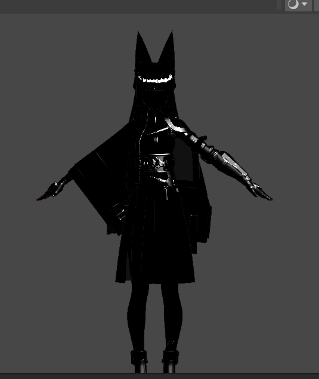  
可以看到效果不错，nice！我们继续下一步

## 添加环境光

### 球谐光照原理

想要具体了解的可以去看这篇文章，这边我就不多讲解了  
[球谐函数介绍（Spherical Harmonics）](https://zhuanlan.zhihu.com/p/351289217)

### 添加球谐光照

#### 新增参数

增加环境光强度控制参数

```plain
[Header(Ambient)]
_AmbientColorIntensity("AmbientColorIntensity", Range(0, 1)) = 0.1
```

#### 计算SH

使用GammaColor进行混合颜色和_AmbientColorIntensity控制强度。

最终输出颜色直接加上环境光颜色即可，但这里做了额外的处理，提取出高光颜色大于1的部分在相加，因为SH环境光是加法混合，整体颜色变亮可能会让高光效果不明显，所以这里为增加高光做处理。

```plain
//Sh球谐光照
    float3 ambientColor = SampleSH(pixelNormalWS) * gammaColor * _AmbientColorIntensity;
    float3 color = ambientColor;
    color += pbrDiffuseColor * albedo + pbrSpecularColor * specularColor * albedo;
    color += max(0, pbrSpecularColor * specularColor * albedo - 1);
    color += rimGlowColor;
```

### 当前效果

环境光其实就可以理解为是天空球的颜色。环境光强度也是会受天空球的强度影响的  
调整强度也会影响模型SH的强度

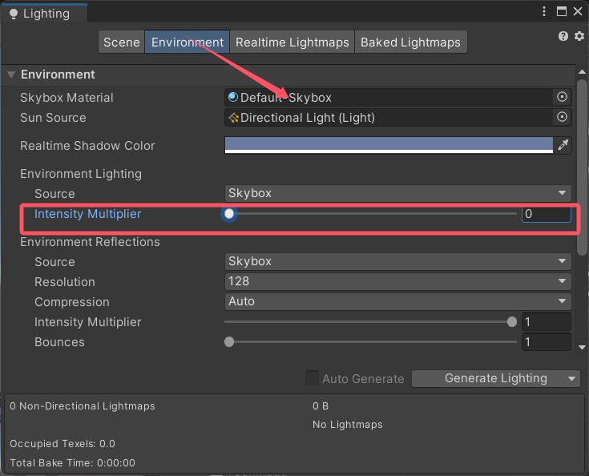  
对比一下下面效果（可能不是特别明显）  
无环境光

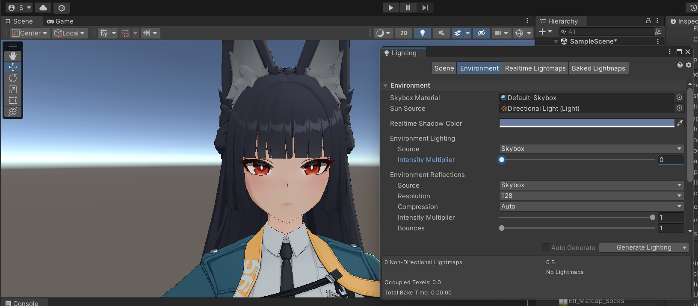  
有环境光

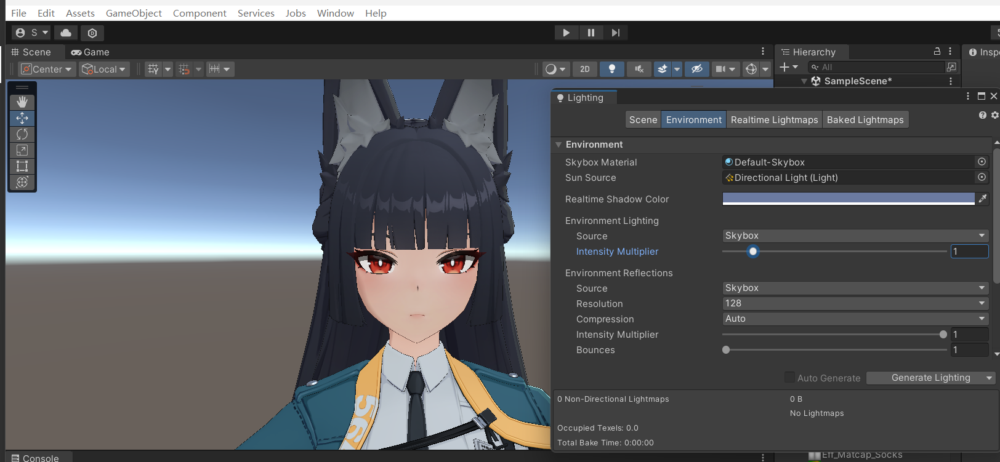  
确实不明显哦，可以把天空球的强度拉高点

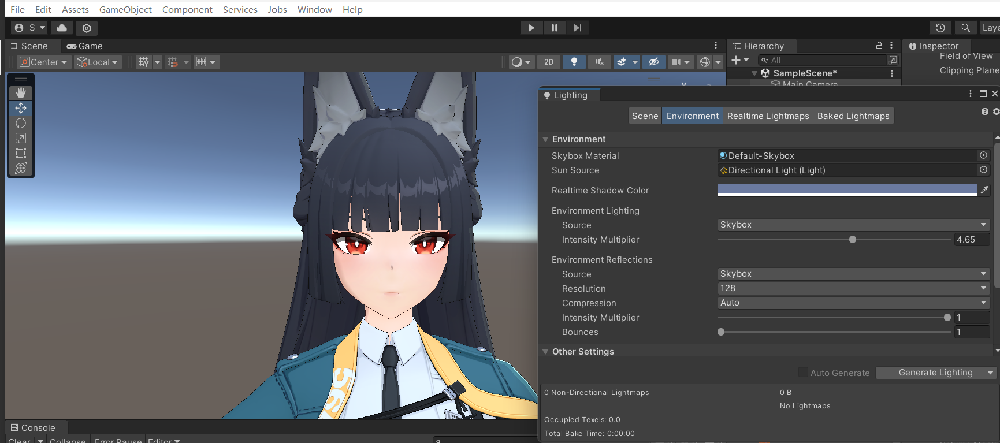  
可以看到环境光的效果明显了很多

环境光也处理完了接下来就到边缘光效果了

## 添加边缘光

### 新增边缘光参数

对应的分别为屏幕空间高光开关，皮肤ID，光源颜色，边缘光染色，屏幕空间下边缘光宽度，阈值，衰减程度，强度

```plain
[Header(RimColor)]
[Toggle(_SCREEN_SPACE_RIM)] _ScreenSpaceRim("Screen Space Rim", int) = 1
[Enum(S0, 0, S1, 1, S2, 2, S3, 3, S4, 4, NoSkin, 5)] _SkinMatID("SkinMatID", int) = 0

[HDR]_UISunColor1("_UISunColor1",  Color) = (1, 1, 1, 1)
[HDR]_UISunColor2("_UISunColor2",  Color) = (1, 1, 1, 1)
[HDR]_UISunColor3("_UISunColor3",  Color) = (1, 1, 1, 1)
[HDR]_UISunColor4("_UISunColor4",  Color) = (1, 1, 1, 1)
[HDR]_UISunColor5("_UISunColor5",  Color) = (1, 1, 1, 1)

[HDR]_RimGlowLightColor1("RimGlowLightColor1",  Color) = (1, 1, 1, 1)
[HDR]_RimGlowLightColor2("RimGlowLightColor2",  Color) = (1, 1, 1, 1)
[HDR]_RimGlowLightColor3("RimGlowLightColor3",  Color) = (1, 1, 1, 1)
[HDR]_RimGlowLightColor4("RimGlowLightColor4",  Color) = (1, 1, 1, 1)
[HDR]_RimGlowLightColor5("RimGlowLightColor5",  Color) = (1, 1, 1, 1)

_ScreenSpaceRimWidth("Screen Space Rim Width", Range(0, 5)) = 1
_ScreenSpaceRimThreshold("Screen Space Rim Threshold", Range(0, 1)) = 0.01
_ScreenSpaceRimFadeout("Screen Space Rim Fadeout", Range(0, 10)) = 0.5
_ScreenSpaceRimBrightness("Screen Space Rim Brightness", Range(0, 10)) = 1
```

宏开关声明与参数申明我就不在单独贴出来了，相信你们也能自己补上

### 相关宏函数增加

方便后续计算添加了pow宏函数

```plain
#define DEFINE_POW(TYPE) \
TYPE pow2(TYPE x) { return TYPE(x * x);} \
TYPE##2 pow2(TYPE##2 x) { return TYPE##2(x * x);} \
TYPE##3 pow2(TYPE##3 x) { return TYPE##3(x * x);} \
TYPE##4 pow2(TYPE##4 x) { return TYPE##4(x * x);} \
TYPE pow3(TYPE x) { return TYPE(x * x * x);} \
TYPE##2 pow3(TYPE##2 x) { return TYPE##2(x * x * x);} \
TYPE##3 pow3(TYPE##3 x) { return TYPE##3(x * x * x);} \
TYPE##4 pow3(TYPE##4 x) { return TYPE##4(x * x * x);} \
TYPE pow4(TYPE x) { TYPE xx = x * x; return TYPE(xx * xx);} \
TYPE##2 pow4(TYPE##2 x) { TYPE##2 xx = x * x; return TYPE##2(xx * xx);} \
TYPE##3 pow4(TYPE##3 x) { TYPE##3 xx = x * x; return TYPE##3(xx * xx);} \
TYPE##4 pow4(TYPE##4 x) { TYPE##4 xx = x * x; return TYPE##4(xx * xx);} \
TYPE pow5(TYPE x) { TYPE xx = x * x; return TYPE(xx * xx * x);} \
TYPE##2 pow5(TYPE##2 x) { TYPE##2 xx = x * x; return TYPE##2(xx * xx * x);} \
TYPE##3 pow5(TYPE##3 x) { TYPE##3 xx = x * x; return TYPE##3(xx * xx * x);} \
TYPE##4 pow5(TYPE##4 x) { TYPE##4 xx = x * x; return TYPE##4(xx * xx * x);} \
TYPE pow6(TYPE x) { TYPE xx = x * x; return TYPE(xx * xx * xx);} \
TYPE##2 pow6(TYPE##2 x) { TYPE##2 xx = x * x; return TYPE##2(xx * xx * xx);} \
TYPE##3 pow6(TYPE##3 x) { TYPE##3 xx = x * x; return TYPE##3(xx * xx * xx);} \
TYPE##4 pow6(TYPE##4 x) { TYPE##4 xx = x * x; return TYPE##4(xx * xx * xx);} 

DEFINE_POW(bool)
DEFINE_POW(uint)
DEFINE_POW(int)
DEFINE_POW(float)
DEFINE_POW(half)
```

### 对皮肤部分进行区分

因为这里处理为皮肤和服装的背光强度是不一样的，所以进行划分，这里直接指定材质ID是皮肤

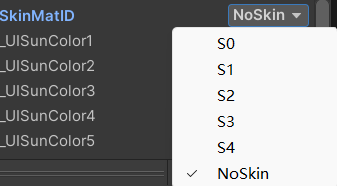

### 计算相关衰减项

#### 背光衰减

因为边缘光是根据视线方向和灯光方向来控制的，比如说背光的时候边缘光会很强，而面光面就比较弱。所以先计算LOV 这里对（-LOV）进行了重映射，映射到0~1，这里注意是（-LOV），因为LOV根据点乘特征同向为一反向为-1，所以面光面为1，背光面为-1，而边缘光应该以背光面为主，所以取（-LOV）计算，得到viewAttenuation

```plain
float3 rimGlowColor = 0;
{
    //获取对应ID设置为皮肤
    bool isSkin = materialId == _SkinMatID;

    //背光方向衰减
    float LoV = dot(lightDirectionWS, viewDirWS);
    float viewAttenuation = -LoV * 0.5 + 0.5;
}
```

这里得到viewAttenuation后还做了额外的处理，先进行平方后在乘0.5和加0.5，相当于平滑过渡，同时也是为了面光面也有边缘光为0.5，不为0，下面的函数图可以更好理解

```plain
//进行0.5~1的平滑映射
viewAttenuation = pow2(viewAttenuation);
viewAttenuation = viewAttenuation * 0.5 + 0.5;
```

##### 函数图

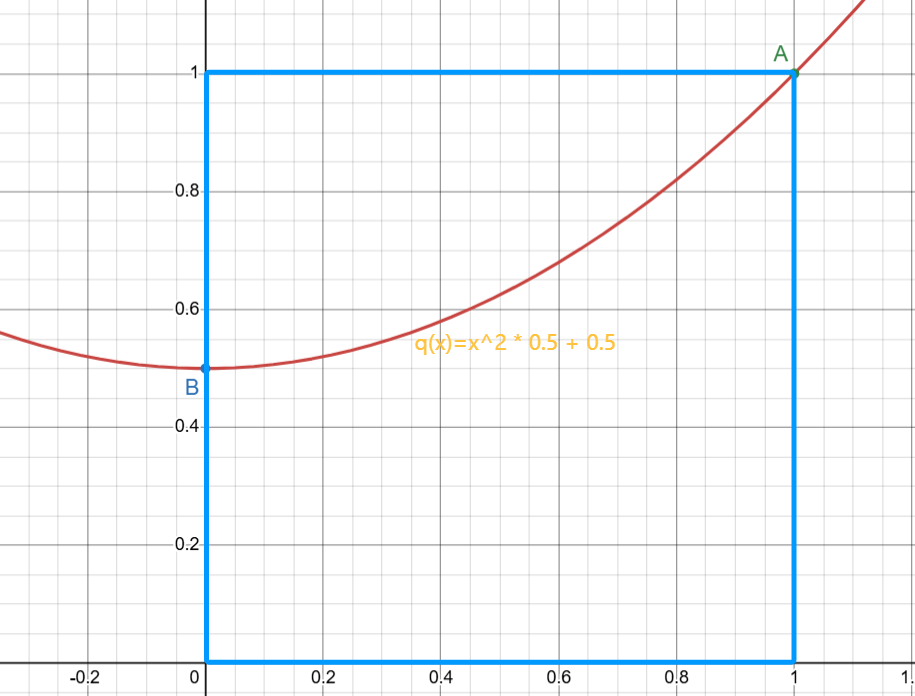

#### 法线垂直方向衰减

这里取法线的Y方向，也就是垂直的方向，重映射到0~1

```plain
//法线垂直方向衰减
float verticalAttenuation =  pixelNormalWS.y * 0.5 + 0.5;
```

这里对皮肤和服装部分进行区分，让服装的强度低一点直接进行平方，最后整体进行平滑处理

```plain
verticalAttenuation = isSkin ? verticalAttenuation : pow2(verticalAttenuation);
verticalAttenuation = smoothstep(0, 1, verticalAttenuation);
```

#### 兰伯特方向衰减

其实就光源对于模型的衰减，也适用于边缘光。这里因为之前计算过投影，所以也追加进去

```plain
//兰伯特衰减
float lightAttenuation = saturate(dot(pixelNormalWS,lightDirectionWS)) * shadowAttenuation;
```

#### 菲涅尔衰减

这一步是真正求边缘光的步骤，一般边缘光都是通过菲涅尔进行计算。因为这里需要对相机距离进行反馈，所以先计算相机距离

计算菲涅尔NOV

这是NOV的值，需要的边缘光是黑色部分，所以边缘光需要的值是1-NOV

```plain
//菲涅尔
float cameraDistance = length(input.viewDirWS);
float NoV = dot(pixelNormalWS, viewDirWS);
float fresnelDistanceFade = (isSkin ? 0.75 : 0.65) - 0.45 * min(1, cameraDistance / 12.0);
float fresnelAttenuation = 1 - NoV - fresnelDistanceFade;
```

对皮肤进行判断，皮肤的菲涅尔效果应该比衣服更弱，所以被(1-NOV)减去的值应该更多，然后衰减程度也和相机距离相关，min(1, cameraDistance / 12.0)最大值为1，当相机距离为12米时为最大，这里12.0就是相机距离，综合起来看就是随距离越远，菲涅尔强度略微增强（其实肉眼看不太出来）

最后根据皮肤划分进行平滑调整

```plain
float fresnelSoftness = isSkin ? 0.2 : 0.3;
fresnelAttenuation = smoothstep(0, fresnelSoftness, fresnelAttenuation);
```

#### 相机距离衰减

这里相当于5m之后开始逐渐衰减，5m之前不变，因为小于5的时候减去的部分是负数进行钳制就会变成0 !

```plain
//相机距离衰减
//5m后进行衰减
float distanceAttenuation = 1 - 0.7 * saturate(cameraDistance * 0.2 - 1);
```

函数如下

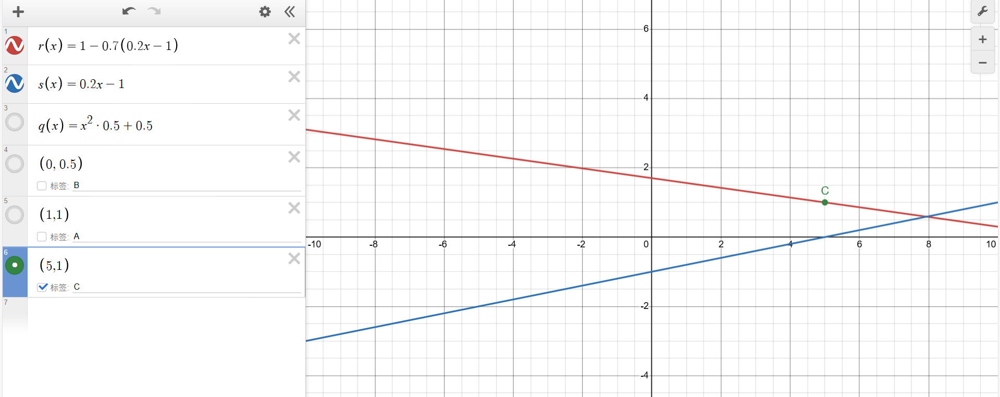

#### 背光外围向中心方向衰减

```plain
//背光中心外围方向衰减
float edgeAttenuation = 1 - pow4(pow5(viewAttenuation));
```

### 边缘光颜色控制

#### 阳光颜色混色

皮肤只混合灰度，而非皮肤混合颜色

```plain
 //阳光染色
float3 sunColor = select(materialId,
    _UISunColor1,
    _UISunColor2,
    _UISunColor3,
    _UISunColor4,
    _UISunColor5
);
//皮肤部分只混和灰度，非皮肤混合阳光颜色
float sunLuminance = Luminance(sunColor);
sunColor = isSkin ? sunColor : sunLuminance.xxx;
```

这里对阳光强度控制，如果亮度为1，效果大概就是缩放大概1/2.1倍，这里是对暗处提亮而亮的地方进行压制防止过曝

```plain
//获取缩放系数，1~平滑增大
float3 sunColorScaled = pow2(pow4(sunColor));
sunColorScaled /= max(1e-5, dot(sunColorScaled, 0.7));
//缩放控制
sunColor = AverageColor(sunColor) * sunColorScaled;
```

#### 边缘光混合漫反射

不使用边缘光的地方衰减使用Albedo

```plain
//投影部分为阳光颜色
sunColor = lerp(albedo, sunColor, shadowAttenuation);
//背光方向中心保持Albedo颜色
sunColor = lerp(albedo, sunColor, edgeAttenuation);
```

#### 边缘光使用提亮过后的漫反射颜色

```plain
float3 rimDiffuse = pow(max(1e-5, pbrDiffuseColor), 0.2);
rimDiffuse = normalize(rimDiffuse);
```

#### 平均边缘光的强度

这里对边缘光的漫反射强度做处理，大概是平均边缘光的强度，漫反射强度越高，边缘光减弱

```plain
//平均漫反射和边缘光强度
float diffuseBrightness = AverageColor(pbrDiffuseColor);
diffuseBrightness = (1 - 0.2 * pow2(diffuseBrightness)) * 0.1;
rimDiffuse *= diffuseBrightness;
```

曲线大致如下

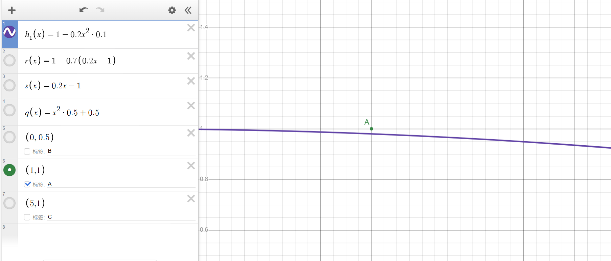

#### 边缘光镜面反射混合

边缘光的镜面反射直接使用PBR镜面反射，使用金属度划分插值边缘光漫反射和镜面反射程度

```plain
float3 rimSpecular = pbrSpecularColor;
float3 rimColor = lerp(rimDiffuse, rimSpecular, metallic);
```

整体控制强度，然后乘上上面计算的衰减参数和光源颜色就得到边缘光了

```plain
rimColor *= 48;
rimColor *= fresnelAttenuation * verticalAttenuation * viewAttenuation * lightAttenuation * distanceAttenuation * sunColor;
```

### 边缘光染色和强度控制

对边缘光进行染色。最后对边缘光进行强度控制，效果也是平滑提亮

```plain
float3 glowColor = select(materialId,
    _RimGlowLightColor1,
    _RimGlowLightColor2,
    _RimGlowLightColor3,
    _RimGlowLightColor4,
    _RimGlowLightColor5
);

rimColor *= glowColor;


//1以上的亮度更平缓的增亮
float3 rimColorBrightness = AverageColor(rimColor);
rimColorBrightness = pow2(rimColorBrightness);
rimColorBrightness = 1 + 0.5 * rimColorBrightness;
rimColor *= rimColorBrightness;

rimGlowColor = rimColor;
```

曲线大概如下

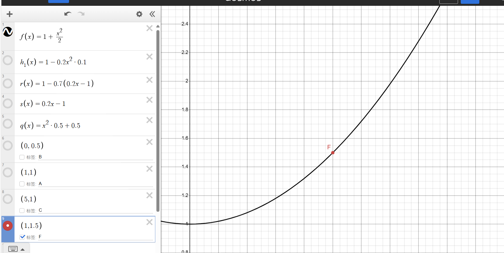

### 屏幕空间边缘光

这里添加了屏幕空间的边缘光，和计算投影是一个原理，采样偏移的深度图与原深度图进行相减。计算最后就是乘上一个强度系数控制

```plain
//屏幕空间边缘光
float screenSpaceRim = 1.0;
#if _SCREEN_SPACE_RIM
{
    float linearEyeDepth = input.positionCS.w;
    float3 normalVS = TransformWorldToViewDir(normalWS);
    float2 UVOffset = float2(normalize(normalVS.xy)) * _ScreenSpaceRimWidth / linearEyeDepth;
    int2 texPos = input.positionCS.xy + UVOffset;
    texPos = min(max(0, texPos), _ScaledScreenParams.xy - 1); 
    float offsetSceneDepth = LoadSceneDepth(texPos);
    float offsetSceneLinearEyeDepth = LinearEyeDepth(offsetSceneDepth, _ZBufferParams);
    screenSpaceRim = saturate((offsetSceneLinearEyeDepth - (linearEyeDepth + _ScreenSpaceRimThreshold)) * 10 / _ScreenSpaceRimFadeout);

    screenSpaceRim *= _ScreenSpaceRimBrightness;
}
#endif
```

最后混合输出

### 边缘光效果

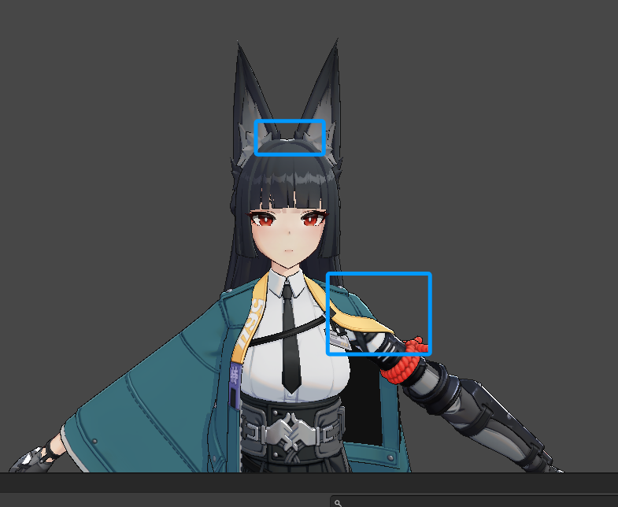

边缘光效果出来啦！现在还有最后一步就是目透效果的实现啦

## 眼睛处理

### 眼部参数追加

眼睛需要进行半透明处理以及透过头发需要进行蒙版测试所以添加相关参数

```plain
[Enum(UnityEngine.Rendering.BlendMode)]_BlendSrc("SrcAlpha混合源乘子", int) = 1
[Enum(UnityEngine.Rendering.BlendMode)]_BlendDst("DstAlpha混合目标乘子", int) = 0
[Enum(UnityEngine.Rendering.BlendOp)]_BlendOp("Alpha混合算符", int) = 0

_StencilRef("蒙版值", int) = 0
[Enum(UnityEngine.Rendering.CompareFunction)]_StencilComp("蒙版判断条件", int) = 0
[Enum(UnityEngine.Rendering.StencilOp)]_StencilPassOp("蒙版测试通过", int) = 0
[Enum(UnityEngine.Rendering.StencilOp)]_StencilFailOp("蒙版测试失败", int) = 0
[Enum(UnityEngine.Rendering.StencilOp)]_StencilZFailOp("深度Z测试失败", int) = 0

//眼睛重绘
[Header(EyeReDrawPassOption)]
[Toggle(_SRP_DEFAULT_PASS)] _SRP_DEFAULT_PASS(" SRP Default Pass", int) = 0
[Enum(UnityEngine.Rendering.BlendMode)]_SRPBlendSrc("SRPSrcAlpha混合源乘子", int) = 1
[Enum(UnityEngine.Rendering.BlendMode)]_SRPBlendDst("SRPDstAlpha混合目标乘子", int) = 0
[Enum(UnityEngine.Rendering.BlendOp)]_SRPBlendOp("SRPAlpha混合算符", int) = 0
_SRPStencilRef("SRP蒙版值", int) = 0
[Enum(UnityEngine.Rendering.CompareFunction)]_SRPStencilComp("SRP蒙版判断条件", int) = 0
[Enum(UnityEngine.Rendering.StencilOp)]_SRPStencilPassOp("SRP蒙版测试通过", int) = 0
[Enum(UnityEngine.Rendering.StencilOp)]_SRPStencilFailOp("SRP蒙版测试失败", int) = 0
[Enum(UnityEngine.Rendering.StencilOp)]_SRPStencilZFailOp("SRP深度Z测试失败", int) = 0
```

参数申明跳过，相信你们自己能写，写不出来想想是不是是自己的问题

### 对应在基础Pass里面追加

```plain
//蒙版测试
Stencil {
    Ref [_StencilRef]
    Comp [_StencilComp]
    Pass [_StencilPassOp]
    Fail [_StencilFailOp]
    ZFail [_StencilZFailOp]
}
```

### 透明度调整

眼影的基础染色给个纯黑在给一些透明度  
就是把alpha值线调到0.5左右

### 调整混合模式

这里设置为SrcAlpha和 OneMinusSrcAlpha就好了，默认是One和Zero，同样的调整内高光  
当当效果出来了

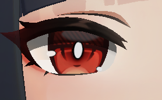

## 蒙版测试原理

这里有些绕，既要考虑蒙版测试和深度测试还得考虑渲染顺序 进行的优先级是先渲染顺序然后蒙版测试最后深度测试

### 渲染队列

Unity使用渲染队列调整渲染顺序，数字越大渲染顺序越靠后

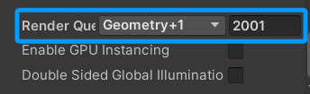

### 蒙版测试和深度测试

举一个例子，其他情况可以自己去推。给出两个物体AB，分别设置一个蒙版值，渲染顺序为A->B，前后关系是A在B前方。 这里注意默认蒙版值基数为0，判断条件都是以这个基数判断 A设置蒙版值为2，判断条件为大于等于，操作为“替换Replace”。 B物体蒙版值为3，判断条件为大于等于，操作为“替换Replace”。

首先考虑渲染顺序是A->B，所以A先计算 A首先进行模板测试，判断条件是大于等于2，蒙版值为2>基数0，模版测试通过，因为操作为“替换Replace”，所以在A渲染时蒙版值基数被替换为2。然后是深度测试，因为率先渲染，所以无遮挡，不需要剔除，深度测试通过

接下来是B进行渲染 先模板测试，判断条件是大于等于3，蒙版值为3>基数2，模版测试通过，因为操作为“替换Replace”，所以在B渲染时蒙版值基数被替换为3，重叠部分也变成了3，所以重叠部分应该为B的颜色。然后是深度测试，因为A先渲染，所以有遮挡关系，那么重叠部分B的颜色就会被剔除，最终效果上就为黑色

## 最后值得一提的是如果遮挡物是半透明，那么深度剔除就不会生效的

## 排序设置

### 渲染队列设置

基于上面说的原理，先对模型进行渲染排序，只需要对眼睛头发排序就行了 先对眼睛部分排序

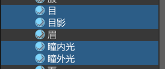

眼睛肯定是最先渲染所以给个2001

其次就是高光了，内高光和外高光都给个2002

最后就是眼影了，给2003

头发就在后一点，2004吧

### 蒙版设置

需要眼睛在头发前面，那么先从整体来看，默认蒙版基数是0，头发是最后渲染。因为眼睛部分先渲染所以会替换蒙版值，那么只要保证头发的蒙版值比眼部的小就行了。这里直接让头发部分按照基数0来设置，而眼睛就大于这个值就行了 头发，判断条件为大于等于，因为默认基数为0，这里蒙版值给的0，可以保证默认通过蒙版测试

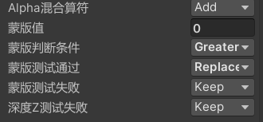  
眼睛部分虽然可以都设为同一的蒙版值，但最好还是区分一下，从里到外递增，判断条件都是大于等于 眼睛 !

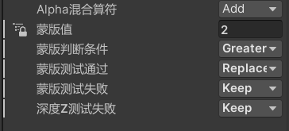  
内高光和外高光

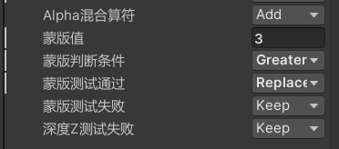  
眼影

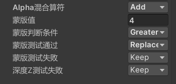  
现在就有了透过头发的效果了，但是没有颜色，原因和上面说的一样，深度剔除给剔除了  
当当效果出来了，但是想要变成下面的效果还有一个关键的一步那就是眼睛重绘，我们继续往下讲


## 重新绘制眼睛

### 追加Pass

为了解决穿过头发没有颜色的问题，这里需要进行重新绘制，就是在调一遍Pass 这里新增了一个无光照Pass

这里相当于在跑一遍之前的BasePass，而如果不开启就为空，什么也不做

```plain
{
    Name"EyeReDrawPass"
    
    Tags{
        "LightMode" = "SRPDefaultUnlit"
    }
    
    ZWrite [_ZWrite]
    Cull [_Cull]
    BlendOp [_SRPBlendOp]               //混合算符
    Blend [_SRPBlendSrc] [_SRPBlendDst]    //混合乘子

    //蒙版测试
    Stencil {
        Ref [_SRPStencilRef]
        Comp [_SRPStencilComp]
        Pass [_SRPStencilPassOp]
        Fail [_SRPStencilFailOp]
        ZFail [_SRPStencilZFailOp]
    }

    // HLSL程序段

    HLSLPROGRAM
    #pragma vertex MainVS2
    #pragma fragment MainPS2
    #pragma multi_compile_fog
    

    #if _SRP_DEFAULT_PASS
    UniversalVaryings MainVS2(UniversalAttributes input){return MainVS(input);}
    float4 MainPS2(UniversalVaryings input, bool isFrontFace : SV_IsFrontFace) : SV_Target{return MainPS(input, isFrontFace);}
    #else
    void MainVS2(){}
    void MainPS2(){}
    #endif

    ENDHLSL

}
```

### 参数调整

头发贴图中有透明度信息的，这里可以处理眼睛透过头发的强度

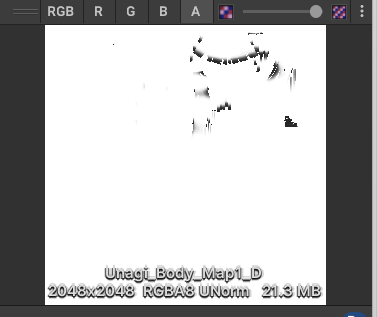

这里进行透明度设置，以及蒙版值，之前设置的眼睛部分最小的蒙版值是眼睛的也就是2，所以这里设置为小于2的值就好了

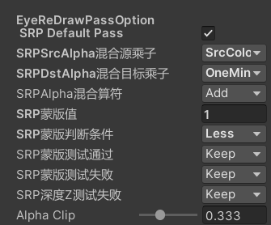

## 最终成品效果

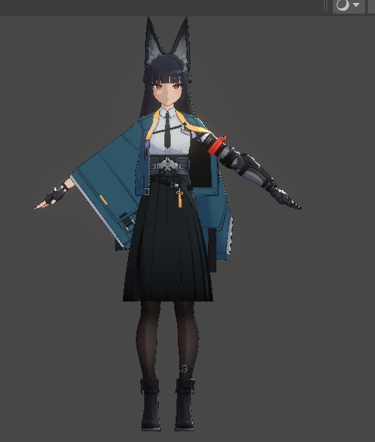

## 最后

感谢你能坚持看到这里，感谢你看我花了四天左右时间从效果实现到实现过程文档的完成，感谢你看完一整篇旷世之史，谢谢！！
